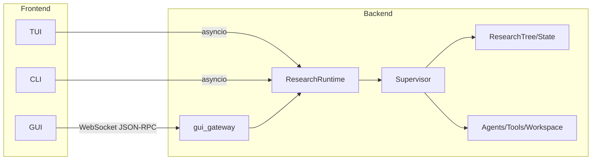

# 1 整体架构

## 1.1 系统定义

Athena 是面向 AI4ML/AI4S 的自动研究系统。系统接收用户给出的机器学习任务描述与数据集路径，自动完成数据探索、假设生成、实验执行、结果评估与最终报告。系统不要求用户预先掌握代码细节，只需提供任务与数据。

系统的核心流程为：

```text
PREPARE → SEARCH → VALIDATE → COMPLETED
```

该流程由 Supervisor 驱动。Supervisor 是研究状态与实验图的唯一写者，所有对 `ResearchState` 与 `ResearchTree` 的变更均经由它完成。

依据：

- `README.md` 首段。
- `src/athena/research/runtime/facade.py:157`
- `src/athena/research/supervisor/supervisor.py:85`

## 1.2 三层结构

系统在逻辑上分为三层：

```text
前端层：GUI、TUI、CLI、Headless 脚本
协议层：WebSocket JSON-RPC、进程内事件
后端层：gui_gateway、ResearchRuntime、Supervisor、核心子系统
```

前端层负责与用户交互，不执行研究逻辑。协议层负责前端与后端之间的消息传递。后端层负责实际的研究流程、Agent 调度、实验执行与状态持久化。

## 1.3 前端组成

前端共有四类入口：

| 前端 | 技术 | 入口 |
|---|---|---|
| 桌面 GUI | React 18 + Vite + ReactFlow + Tauri 2 | `athena-gui/` |
| TUI | Python `prompt_toolkit` | `src/athena_tui/` |
| CLI | Python `argparse` | `src/athena/cli.py` |
| Headless | Python 脚本 | `scripts/run_headless.py` |

GUI 是主要交互界面。它通过 `athena-gui/src/lib/ws-backend.ts` 建立 WebSocket 连接，通过 `athena-gui/src/lib/tauri-bridge.ts` 提供 Tauri 桥接。

`WsBackend` 的核心逻辑：

- `connect(url)`：建立连接，失败后按指数退避重连。
- `call(method, params)`：发送 JSON-RPC 请求，按 `request_id` 匹配响应。
- `subscribe(handler)`：注册事件处理函数。
- `handleMessage`：区分响应与事件。

依据：`athena-gui/src/lib/ws-backend.ts:35-144`。

TUI 在 `src/athena_tui/entrypoint.py` 中启动。`main()` 检查终端是否为交互式 TTY，非交互环境会提示改用 CLI。

CLI 在 `src/athena/cli.py::main` 中解析子命令，支持 `run`、`survey`、`bench`、`kaggle`、`status`、`pause`、`resume`、`stop` 等命令。

Headless 脚本 `scripts/run_headless.py` 直接构造 `ResearchRuntime`，订阅事件并打印进度，适合批处理与 CI。

## 1.4 后端组成

后端核心模块如下：

| 模块 | 职责 |
|---|---|
| `gui_gateway` | WebSocket 网关，将前端 RPC 转译为 `ResearchRuntime` 调用 |
| `ResearchRuntime` | 组合根，装配全部基础设施 |
| `Supervisor` | 研究流程唯一写者，驱动阶段机 |
| `athena.core` | 领域模型、Agent 基建、Tool、Workspace、Artifact、ResearchTree |
| `athena.agents` | 具体业务 Agent |
| `athena.research` | 研究运行时、Supervisor、Idea Generation、论文系统 |
| `athena.app_server` | Thread/Turn 协议层 |
| `athena.memory` | 上下文管理、压缩、rollout |
| `athena.kaggle` | Kaggle 数据接入 |
| `athena.gui` | GUI 查询服务 |

`ResearchRuntime` 在 `src/athena/research/runtime/facade.py:157` 定义。其构造函数负责：

1. 解析项目根与状态根路径；
2. 创建 `LocalArtifactStore`；
3. 创建 `AgentTypeRegistry` 与 `AgentRuntime`；
4. 创建 `ExecutionRuntime`、`DataScriptRunner`、`TrustedEvaluator`；
5. 创建 `LocalGitWorkspace`；
6. 加载或新建 `ResearchTree` 与 `ResearchState`；
7. 创建 `EventProjector`、`RuntimeEvents`、`AgentTurnRunner`、`PhaseRunner`、`Supervisor`。

依据：`src/athena/research/runtime/facade.py:160-339`。

## 1.5 前后端协议

### 1.5.1 传输

前端与后端之间使用 WebSocket。默认地址为 `ws://127.0.0.1:17601`。前端可通过 `VITE_GUI_WS_URL` 或 `VITE_GUI_PORT` 覆盖；后端可通过 `ATHENA_GUI_PORT` 覆盖。

依据：

- `athena-gui/src/lib/ws-backend.ts:25-30`
- `src/gui_gateway/__main__.py:42-55`

### 1.5.2 信封

请求：

```json
{
  "request_id": 1,
  "method": "tree_get",
  "params": {}
}
```

响应：

```json
{
  "request_id": 1,
  "result": {},
  "error": null
}
```

事件：

```json
{
  "kind": "state",
  "data": { "phase": "SEARCH", "status": "RUNNING" }
}
```

信封类型来自 `src/athena/app_server/protocol.py`。`gui_gateway` 的 `WebSocketTransport` 直接复用该协议 DTO，将前端消息解析为 `RequestEnvelope`，并将 `ResearchRuntime` 事件包装为 `{"kind": ..., "data": ...}` 推给前端。

依据：`src/gui_gateway/transport.py:10-15`、`48-51`。

### 1.5.3 方法

GUI 方法表定义在 `src/gui_gateway/handler.py:28-72` 的 `SUPPORTED_METHODS`。方法分为：

- 运行时控制：`start`、`start_task`、`message`、`pause`、`resume`、`stop`
- 状态与树：`state_get`、`tree_get`、`tree_save`、`tree_load`
- 会话：`sessions_list`、`session_switch`、`session_delete`
- 假设图：`hypothesis_graph`、`graph_algorithms`、`graph_algorithm`
- 设置：`settings_get`、`settings_set`、`set_project_root`
- 轨迹：`traces_list`、`trace_get`
- 实验：`experiments_list`、`experiment_get`、`experiment_transition`、`experiment_set_sota`

## 1.6 架构说明

### 1.6.1 进程关系



前端与后端之间的连接关系可以概括如下。GUI 通过 WebSocket 与 `gui_gateway` 通信；TUI 与 CLI 在进程内直接驱动 `ResearchRuntime`。`gui_gateway` 最终也进入 `ResearchRuntime`，因此后端三条入口最终汇聚于同一个组合根。`ResearchRuntime` 将控制权交给 `Supervisor`，由后者操作研究树与状态，并调度 Agent、工具与工作区。

### 1.6.2 运行时内部分工

`Supervisor` 是运行时中枢，它同时连接阶段机、搜索循环、Plan 生命周期与 Agent turn 编排。Agent 侧又分为 Provider、ToolRegistry 与 ExecutionRuntime，分别负责模型调用、工具解析与命令执行。事件总线 `RuntimeEvents` 独立于研究逻辑，将状态与输出推送到 TUI、CLI 与 GUI。持久化层位于 `ResearchTree` 与 `ResearchState` 之下，由 Supervisor 统一写入。

## 1.7 启动链路

Tauri 桌面端的启动过程如下：

```text
Tauri 启动
  → 启动 Python gui_gateway 子进程
  → 从 stdout 第一行读取端口
  → 前端 WebSocket 连接 ws://127.0.0.1:<port>
  → 前端调用 RPC 方法
  → gui_gateway 构造/复用 ResearchRuntime
  → ResearchRuntime 驱动 Supervisor
```

`gui_gateway` 的 `start_server()` 在 `src/gui_gateway/__main__.py:58-89` 实现。它创建 `HumanRequestBroker`、`GuiRequestHandler`、`WebSocketTransport`，然后监听 `127.0.0.1`。Tauri 通过读取 stdout 第一行获得实际端口。

## 1.8 关键数据流

一次 GUI 请求的数据流：

```text
前端调用 tree_get
→ WebSocketTransport 解析 RequestEnvelope
→ GuiRequestHandler.dispatch("tree_get")
→ GuiService.tree_get()
→ ResearchRuntime.tree.to_dict()
→ 返回 JSON
```

一次状态推送：

```text
Supervisor 发布 state 事件
→ RuntimeEvents
→ WebSocketTransport.emit_event
→ 前端 useEvents 更新状态
```

## 1.9 平行实现

`athena-rust` 是 Rust 平行实现，包含 `athena-types`、`athena-protocol`、`athena-server` 等 crate。

当前 Python 是生产主入口，Rust 尚未接入生产默认路径。

依据：`athena-rust/README.md:5-6`。

## 1.10 后端目录结构

```text
src/athena/
├── agents/           # 业务 Agent
├── app_server/       # Thread/Turn 协议层
├── core/             # 领域模型与基建
├── execution/        # 命令执行
├── gui/              # GUI 查询服务
├── kaggle/           # Kaggle 接入
├── memory/           # 上下文与 rollout
├── research/         # 研究运行时
├── retrieval/        # 检索
└── utils/            # 工具
```

`src/athena_tui/` 与 `src/gui_gateway/` 分别提供 TUI 与 WebSocket 网关。

## 1.11 运行模式

- `Athena-cli run`：headless 全流程。
- `Athena-tui`：交互式全屏。
- `python -m gui_gateway`：GUI 后端。
- `scripts/run_headless.py`：批处理脚本。

## 1.12 证据

| 结论 | 证据 |
|---|---|
| 默认端口 17601 | `src/gui_gateway/__main__.py:42-55` |
| WebSocket 复用协议 DTO | `src/gui_gateway/transport.py:10-15` |
| 前端 WS 客户端 | `athena-gui/src/lib/ws-backend.ts:35-144` |
| 后端组合根 | `src/athena/research/runtime/facade.py:157` |
| Supervisor 唯一写者 | `src/athena/research/supervisor/supervisor.py:85` |
| TUI 非交互检查 | `src/athena_tui/entrypoint.py:44-49` |
| CLI 子命令 | `src/athena/cli.py:381-472` |
| GUI 方法表 | `src/gui_gateway/handler.py:28-72` |
