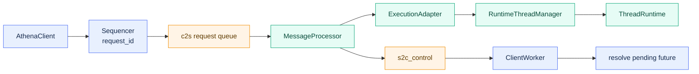

# 2 app server 架构

## 2.1 定义

`src/athena/app_server` 是 Athena 的进程内 Client/Server 协议子系统。它提供 JSON-RPC 风格的协议契约、有界队列传输、消息处理器状态机、执行适配层，以及基于 Thread/Turn 的运行时。

该子系统有两种使用方式：

1. `AgentRuntime` 将逻辑 Agent 映射为一条 `ThreadRuntime`。`AgentRuntime` 在 `src/athena/core/agent/agent_runtime.py:107-144` 中创建 `RuntimeThreadManager`，因此 `ResearchRuntime` 间接依赖 `app_server`。
2. `gui_gateway` 复用 `app_server.protocol` 的 DTO，在 WebSocket 传输层直接调用 `GuiRequestHandler`，不经过完整的 `MessageProcessor` 栈。

Rust 对应实现位于 `athena-rust/crates/athena-server`，是契约优先的迁移版本。

## 2.2 组件结构



上图只展示请求/响应控制链。客户端由 `Sequencer` 分配 request id，请求经 `c2s` 进入 `MessageProcessor`；需要执行的请求再由 `ExecutionAdapter` 进入线程运行时，响应则经 `s2c_control` 交给 `ClientWorker`。

事件采用独立通道：


app_server 的整体拓扑仍由客户端、传输层与服务端三部分组成，但拆图后能直接看出控制面与事件面的分离。事件压力不会占用正常请求/响应通道；`EventJournal`、订阅注册表和 `FairMux` 只服务于事件分发。

组件职责：

- `AthenaClient`：客户端门面，封装请求、通知、事件读取、服务端请求回复。
- `ClientWorker`：后台读取控制通道与事件通道，将响应路由到 pending future。
- `Sequencer`：单调生成 `request_id`，`0` 保留给 initialize。
- `Transport`：三个有界队列，分离控制与事件。
- `MessageProcessor`：服务端状态机与请求分发。
- `ExecutionAdapter`：协议方法到 ThreadManager 的映射。
- `RuntimeThreadManager`：进程级 Thread 注册表与工厂。
- `ThreadRuntime`：单 Thread 执行容器。
- `EventJournal`：append-only 事件日志。
- `SubscriptionRegistry` / `FairMux`：事件订阅与公平分发。

## 2.3 协议层

### 2.3.1 DTO 基类

所有协议 DTO 继承 `ProtocolModel`：

```python
class ProtocolModel(BaseModel):
    model_config = ConfigDict(frozen=True, extra="forbid")
```

该约束保证协议对象不可变，且拒绝未知字段。Rust 侧使用 `#[serde(deny_unknown_fields)]` 对齐。

依据：`src/athena/app_server/protocol.py:13-16`。

### 2.3.2 信封

```python
class RequestEnvelope(ProtocolModel):
    request_id: int  # >= 0
    method: str
    params: dict[str, Any] | None = None

class ResponseEnvelope(ProtocolModel):
    request_id: int
    result: dict[str, Any] | None = None
    error: RpcError | None = None
```

### 2.3.3 通知与服务端请求

- `ClientNotification`：Client → Server 单向通知。
- `ServerRequest`：Server → Client 请求，包含 `server_call_id`。
- `ServerRequestReply`：Client 对 ServerRequest 的回复。
- `EventNotification`：Server → Client 的订阅事件。

依据：`src/athena/app_server/protocol.py:101-126`。

### 2.3.4 方法名

```text
initialize
initialized
thread/start
thread/fork
turn/start
turn/interrupt
thread/subscribe
thread/unsubscribe
server/shutdown
item/approval/request
item/userInput/request
tool/call/request
```

控制方法为 `initialize` 与 `server/shutdown`。

依据：`src/athena/app_server/protocol.py:63-82`。

### 2.3.5 错误码

| 名称 | 值 |
|---|---|
| `INVALID_ARGUMENT` | -32602 |
| `NOT_FOUND` | -32601 |
| `FAILED_PRECONDITION` | -32000 |
| `NOT_INITIALIZED` | -32002 |
| `ALREADY_INITIALIZED` | -32003 |
| `DUPLICATE_REQUEST_ID` | -32004 |
| `OVERLOADED` | -32005 |
| `CLOSED` | -32006 |
| `INTERNAL` | -32603 |

异常映射：

- `ValueError` → `INVALID_ARGUMENT`
- `KeyError` → `NOT_FOUND`
- `RuntimeError` → `FAILED_PRECONDITION`
- 其它 → `INTERNAL`

依据：`src/athena/app_server/protocol.py:19-45`。

## 2.4 传输层

`Transport` 构造三个 `asyncio.Queue`：

```text
_c2s        client → server：请求 / 通知 / server-reply
_s2c_control server → client：响应 / ServerRequest
_s2c_event  server → client：EventNotification
```

容量：control 默认 64，event 默认 256。

### 2.4.1 发送语义

| 操作 | 语义 |
|---|---|
| `send_request` | 有界队列，超时抛 `OverloadedError` |
| `send_notification` | fire-and-forget，满则丢弃 |
| `send_response` / `send_server_request` | awaited put，背压 |
| `send_event` | awaited put，独立事件通道 |
| `aclose` | 幂等关闭，放入 EOF 哨兵 |

依据：`src/athena/app_server/transport.py:18-117`。

## 2.5 MessageProcessor

### 2.5.1 状态机

```text
CREATED → INITIALIZING → READY → DRAINING → TERMINATED
                    ↘ FAILED / FORCE_CLOSED
```

依据：`src/athena/app_server/server.py:30-38`。

### 2.5.2 握手

```text
1. start() 置 INITIALIZING
2. Client 发送 initialize(request_id=0)
3. Server 校验 protocol_version=1
4. Client 发送 initialized 通知
5. Server 进入 READY 并 set_ready
```

依据：`src/athena/app_server/server.py:238-263`。

### 2.5.3 分发

一条请求的完整路径如下：客户端把请求写入传输层，`MessageProcessor` 接收后并不直接执行，而是放入 pending 队列。worker 从队列取出消息，检查重复请求号，取得 semaphore 后才交给 `ExecutionAdapter`。执行完成后响应沿原路返回客户端。这种设计使接收循环与执行循环解耦，即使执行层被慢请求占满，控制消息仍能被接收。

dispatcher 负责接收，worker 负责执行。duplicate request id 检查在 worker 内完成，与 `_inflight` 写入同任务，避免 TOCTOU 竞态。

依据：`src/athena/app_server/server.py:119-192`。

## 2.6 执行适配层

`ExecutionAdapter` 将协议方法映射到 `ThreadManager` / `ThreadHandle`：

| 方法 | 实现 |
|---|---|
| `thread/start` | `manager.start(session_id, context_ref)` |
| `turn/start` | `handle.submit(StartTurn(...))` |
| `turn/interrupt` | `handle.submit(InterruptTurn(...))` |
| `thread/fork` | `manager.fork(...)` |
| `thread/subscribe` | `subscriptions.create(...)` |
| `thread/unsubscribe` | `subscriptions.remove(...)` |

`turn/start` 在适配层生成 `turn_id` 并立即返回，不等待 runner 完成。

依据：`src/athena/app_server/execution.py:23-73`。

## 2.7 线程运行时

### 2.7.1 ThreadManager

`RuntimeThreadManager` 是进程级 Thread 注册表。它负责：

- 创建 ThreadRuntime；
- 为每个 Thread 创建独立 `ContextManager`、`Compactor`、`RolloutRecorder`；
- 提供 `start`、`submit`、`fork`、`interrupt`、`wait_turn`、`events`、`get`、`delete`、`aclose`；
- 校验 id 与 rollout 安全路径。

依据：`src/athena/app_server/thread_manager.py:21-288`。

### 2.7.2 ThreadRuntime

`ThreadRuntime` 是单 Thread 执行容器。状态：

```text
idle → running → closing → closed
```

它拥有：

- submission_queue 与 control_queue；
- `_MergedQueue` 合并双队列；
- `EventJournal`；
- `ThreadExecutionObserver`；
- 记忆组件。

### 2.7.3 Turn 路径

```text
accept_turn
→ 写 turn_started
→ state = running
→ spawn_turn
→ _run_turn
    ├─ maybe_compact()
    ├─ 快照 ContextManager
    ├─ 执行 runner
    ├─ 成功 → record_items + RunnerSucceeded
    ├─ 取消 → RunnerCancelled
    └─ 异常 → rollback + RunnerFailed
→ submission_loop 消费信号
→ commit_completed / commit_failed / commit_interrupted
```

依据：`src/athena/app_server/thread_runtime.py:270-633`。

## 2.8 事件系统

- `EventJournal`：每 Thread 的 append-only 事件日志。
- `Subscription`：游标 + 有界队列 + pump task。
- `FairMux`：round-robin 从订阅队列取事件，推送到 transport event lane。

依据：`src/athena/app_server/events.py`、`src/athena/app_server/lifecycle.py`。

## 2.9 生命周期

装配：

```text
Transport
→ FairMux
→ ThreadEventHandlerRegistry
→ SubscriptionRegistry
→ MessageProcessor + ExecutionAdapter
→ AthenaClient + ClientWorker
→ initialize 握手
```

关闭：

```text
client.shutdown
→ exit_stack.aclose()
→ manager.aclose
```

依据：`src/athena/app_server/lifecycle.py:117-181`。

## 2.10 GUI 网关关系

`gui_gateway` 不直接使用 `MessageProcessor`。它只复用 `app_server.protocol` 的 DTO，在 `WebSocketTransport` 中直接调用 `GuiRequestHandler.dispatch`。因此 GUI 方法表由 `gui_gateway/handler.py` 定义，而不是 app_server 协议方法表。

依据：`src/gui_gateway/transport.py:1-15`、`src/gui_gateway/handler.py:28-72`。

## 2.11 Rust 对应实现

`athena-rust/crates/athena-server` 模块：

- `transport.rs`
- `processor.rs`
- `execution.rs`
- `lifecycle.rs`
- `subscription.rs`
- `client.rs`

与 Python 的差异：

- Rust 无 `CREATED` / `FAILED` / `FORCE_CLOSED` 状态。
- Rust 暂未完整支持 server-initiated 审批与用户输入。
- Rust `ThreadRuntime` 未完全实现 memory/rollout/observability。

依据：`athena-rust/crates/athena-server/`、`athena-rust/README.md`。

## 2.12 证据

| 结论 | 证据 |
|---|---|
| DTO 约束 | `src/athena/app_server/protocol.py:13-16` |
| 错误码 | `src/athena/app_server/protocol.py:19-30` |
| 方法名 | `src/athena/app_server/protocol.py:63-82` |
| 传输通道 | `src/athena/app_server/transport.py:18-34` |
| 状态机 | `src/athena/app_server/server.py:30-38` |
| 执行适配 | `src/athena/app_server/execution.py:23-73` |
| ThreadManager | `src/athena/app_server/thread_manager.py:21-288` |
| ThreadRuntime | `src/athena/app_server/thread_runtime.py:80-633` |
| Lifecycle | `src/athena/app_server/lifecycle.py:117-181` |
