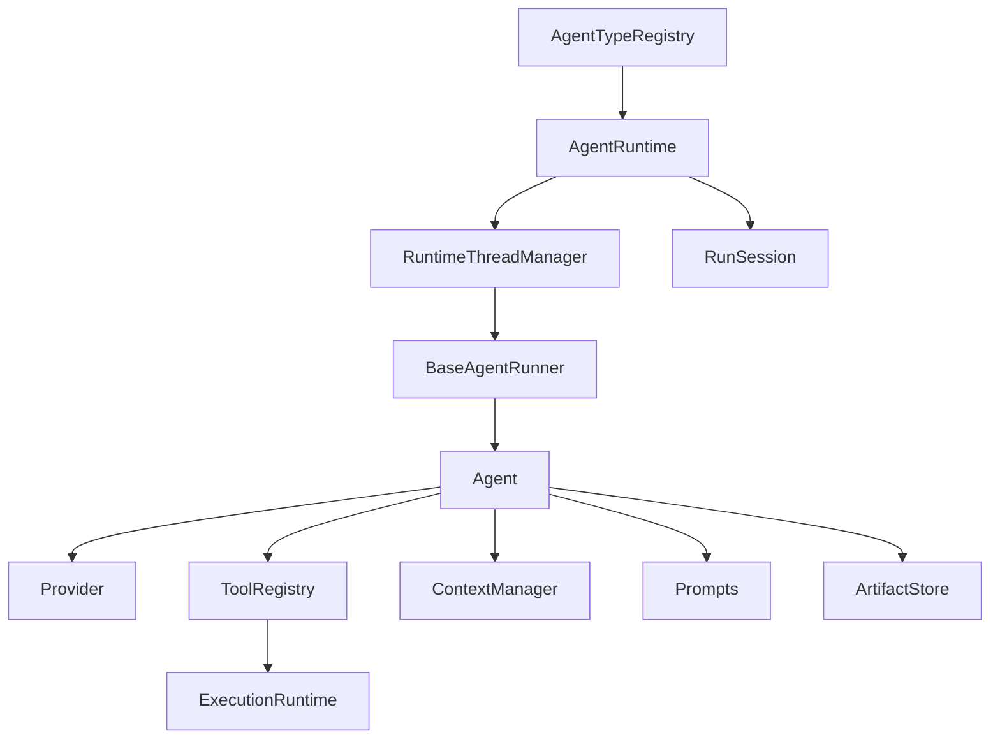

# 3 core/agent 基建与 Agent 最小运行

## 3.1 定义

`src/athena/core/agent` 提供语言无关的 streaming + tool-calling Agent 契约。它由以下核心概念组成：

- Agent：能与 LLM 交互、调用工具、维护上下文、产生结构化输出的执行单元。
- AgentSpec：不可变注册对象，由 runner 与 codec 组成。
- AgentRuntime：Agent 生命周期门面，将逻辑 Agent 映射为 ThreadRuntime。
- BaseAgentRunner：将 `Agent.run(ctx)` 适配到 `AgentRuntime` 的 runner 协议。
- Provider：LLM 流式接口。
- ToolRegistry：工具注册与解析。

## 3.2 组件结构



Agent 基建采用自上而下的分层。注册表只负责类型与工厂映射；`AgentRuntime` 负责生命周期；`ThreadRuntime` 执行具体 turn；`BaseAgentRunner` 把业务 Agent 适配到运行时；`Agent` 内部再调用 Provider、ToolRegistry、ContextManager 与 ArtifactStore。依赖方向始终自上而下，业务 Agent 不直接接触线程与队列。

## 3.3 AgentTypeRegistry

`AgentTypeRegistry` 位于 `src/athena/core/agent/registry.py`。

它保存 `agent_type -> factory` 的映射：

```python
class AgentTypeRegistry:
    def __init__(self):
        self._factories: dict[str, AgentFactory] = {}

    def register(self, agent_type, factory):
        if agent_type in self._factories:
            raise ValueError(f"agent_type already registered: {agent_type}")
        self._factories[agent_type] = factory

    def require_spec(self, agent_type, *, agent_id) -> AgentSpec:
        factory = self._factories.get(agent_type)
        if factory is None:
            raise AgentCommandError(ErrorCode.NOT_FOUND, f"unknown agent_type: {agent_type}")
        return factory(agent_id, None)
```

`require_spec` 每次为指定 agent_id 创建全新 `AgentSpec`。这保证同类型多实例状态独立。

业务注册示例：`register_prompt_agent` 位于 `src/athena/agents/prompt_agent.py:77-126`。它构建一个闭包，每次调用时：

1. 解析 workspace。
2. 构建 `ToolRegistry`。
3. 加载 prompt。
4. 创建 `Agent`。
5. 包装为 `BaseAgentRunner`。
6. 返回 `AgentSpec`。

依据：`src/athena/core/agent/registry.py:20-50`、`src/athena/agents/prompt_agent.py:77-126`。

## 3.4 AgentRuntime

`AgentRuntime` 位于 `src/athena/core/agent/agent_runtime.py:107-144`。

它包装 `RuntimeThreadManager`，使一个逻辑 Agent 等于一条 ThreadRuntime。其核心方法：

| 方法 | 作用 |
|---|---|
| `create_root` | 创建或复用根 Agent |
| `spawn` | 创建子 Agent |
| `followup` | 给已有 Agent 发新 turn |
| `send_message` | 写 mailbox，不唤醒 |
| `resume_agent` | 重开会话并恢复记忆 |
| `wait_run` | 等待单个 run |
| `wait_agent` | 等待多个 Agent |
| `wait_for` | 注册持久等待 |
| `wait_for_human` | 注册人工等待 |
| `interrupt` / `cancel_run` | 取消 |
| `reap` | 删除一次性 Agent |
| `aclose` | 关闭 |

`_ThreadRunner` 是适配器：

```text
解码 request
→ 创建 RunSession
→ 调用 AgentSpec.runner.run
→ 编码 response
→ 返回 AgentOutcome
```

`create_root` 的流程：

```text
1. 若无 agent_id，调用 _spawn_agent(None, ...)
2. 若 agent_id 已存在：
   a. 校验类型一致
   b. 若已有 run_id，直接返回
   c. 否则编码新任务并 _start_run
3. 否则创建新 Agent
```

`_spawn_agent` 的流程：

```text
1. 检查 runtime 未关闭
2. 检查类型已注册
3. 生成 agent_id
4. registry.require_spec
5. 编码任务
6. manager.start(agent_id, req_ref, thread_id=agent_id)
7. 记录 _FacadeRecord
8. _start_run
```

依据：`src/athena/core/agent/agent_runtime.py:187-246`、`297-303`、`555-586`。

## 3.5 Agent 运行循环

`Agent` 位于 `src/athena/core/agent/runtime.py:95-200`。

```text
Agent.run:
1. 确保 memory 存在
2. 注入 system prompt（每 ContextManager 生命周期一次）
3. 注入用户输入
4. 循环（最多 max_turns）
   a. Provider 流式采样
   b. text_delta → emit agent/text_delta
   c. function_call → 解析工具 → 执行 → 写回 memory
   d. response_completed → break
5. 若有 output_type，校验结构化输出
6. 返回 AgentOutcome
```

### 3.5.1 采样循环

`_sample_once` 位于 `runtime.py:242-349`。它消费 Provider 事件：

- `text_delta`
- `function_call`
- `response_completed`
- `error`

错误处理：若没有 tool call 已派发，则按指数退避重试，最多 5 次。

### 3.5.2 工具并发

`_dispatch_tool_call` 位于 `runtime.py:411-450`。

- `concurrency_safe` 工具可并行。
- 不安全工具通过 serial barrier 串行。
- 未知工具返回可恢复错误，并列出可用工具。

### 3.5.3 结构化输出

`Agent.run` 在最终文本上使用 `output_type.model_validate_json`。解析失败会反馈错误并重试，最多 3 次。成功结果通过 `ArtifactStore.put_text` 保存，返回 `result_ref`。

依据：`src/athena/core/agent/runtime.py:48-66`、`151-185`、`221-450`。

## 3.6 Provider

`Provider` 位于 `src/athena/core/agent/provider.py`。

`ResponsesProvider.stream` 使用 OpenAI Chat Completions 流式接口：

1. 将 `ModelMessage` 转为 OpenAI API messages。
2. 从 `ToolRegistry.specs` 构造 tool definitions。
3. 若有 `output_type` 且工具存在，把 JSON schema 注入 system message。
4. 流式读取 chunks，按 index 缓冲 tool-call delta。
5. `finish_reason == "tool_calls"` 时发出完整 function_call。
6. 每 chunk 检查 cancel。

DeepSeek 会剥离 DSML 语法。

`create_provider` 根据 `settings.provider_kind()` 选择 OpenAI / DeepSeek / Anthropic。Anthropic 当前为抛错 stub。

依据：`src/athena/core/agent/provider.py:43-109`、`211-339`、`408-424`。

## 3.7 Session / Memory / Mailbox

`RunSession` 位于 `src/athena/core/agent/session.py:40-82`。

- `receive_messages()` 返回未读 mailbox 消息，但不清除。
- `checkpoint()` 在正常完成或注册等待后推进游标。
- turn 失败时未读消息不丢失。

`AgentContext` 位于 `src/athena/core/agent/models.py:56-75`，包含：

```text
thread
turn
emit
tools
cancel
memory
input_text
messages
ask_user
```

`ContextManager` 提供版本化消息列表、token 估算、rollback。

`BaseAgentRunner.run` 位于 `src/athena/agents/base_runner.py:84-142`。它：

1. 构造触发消息。
2. 读取 mailbox 未读消息。
3. 将 mailbox 消息以 `[ATHENA MAILBOX MESSAGE]` 信封追加到 memory。
4. 投影工具。
5. 构造 `AgentContext`。
6. 调用 `Agent.run`。
7. 正常返回后 `session.checkpoint()`。

## 3.8 Tool 执行

`ToolSpec` 位于 `src/athena/core/tool_types.py:35-55`：

```text
name
description
input_schema
concurrency_safe
```

Python 工具不提供单工具输出长度设置：消息处理层执行截断，不读取 ToolSpec 配置。
旧 `max_result_chars` 字段没有消费方，已删除；Rust 工具执行器的同名配置不受影响。

`BaseTool` 位于 `src/athena/core/tool.py:28-54`，发出 `tool/begin`、`tool/end`、`tool/error` 事件。

`ToolRegistry` 位于 `src/athena/core/tool.py:179-208`，按名称排序，保证 prompt-cache 稳定。

`@tool` 装饰器从函数签名自动推导 schema。

通用工具位于 `src/athena/agents/tools/generic_tools.py:40-79`：

- `read_file`
- `write_file`
- `shell_command`

依据：`src/athena/core/tool.py:88-176`、`src/athena/agents/tools/generic_tools.py:40-79`。

## 3.9 Agent 最小运行

以 `GeneralAgent` 为例：

```python
from pathlib import Path

from athena.agents.general_agent import register_general_agent, GeneralResult
from athena.core.agent.agent_runtime import AgentRuntime
from athena.core.agent.provider import ResponsesProvider
from athena.core.agent.registry import AgentTypeRegistry
from athena.core.artifact_store import LocalArtifactStore
from athena.execution.runtime import ExecutionRuntime
from athena.research.supervisor.experiment import load_agent_result

root = Path.cwd()
store = LocalArtifactStore(root / ".athena" / "artifacts")
execution = ExecutionRuntime(project_root=root, environment_root=root, store=store)
provider = ResponsesProvider("deepseek-v4-flash")

registry = AgentTypeRegistry()
register_general_agent(
    registry,
    provider=provider,
    artifacts=store,
    project_root=root,
    runtime=execution,
)

agents = AgentRuntime(type_registry=registry, project_root=root)

agent_id, run_id = await agents.create_root(
    "general",
    {"content": "Inspect README.md and summarize the project", "context_refs": []},
    name="general",
)

summary = await agents.wait_run(run_id)
result = await load_agent_result(summary, store, GeneralResult)
print(result.result)
```

最小运行的先后次序如下：应用首先注册类型，然后通过 `create_root` 创建 Agent。`AgentRuntime` 向注册表取得 `AgentSpec`，再启动 `ThreadRuntime`。`ThreadRuntime` 经 `BaseAgentRunner` 构造 `AgentContext`，随后 `Agent` 进入模型与工具之间的循环。输出经过 runner、线程、运行时逐层返回给应用。任何一层失败都会把错误映射为统一的 Agent 错误类型。

## 3.10 业务 Agent

业务 Agent 通过注册函数构造 `Agent` 并包上 `BaseAgentRunner`。常见输出类型：

| Agent | 输出类型 |
|---|---|
| General | `GeneralResult` |
| Plan | `PlanDecision` |
| Data | `EdaResult` |
| Ideator | `IdeatorHypothesisBatch` / `HypothesisBatch` |
| Validate | `ValidationRepair` |
| Supervisor | `SupervisorAnswer` |
| KaggleHandoff | `KaggleHandoffResult` |

Prompt 文件位于 `src/athena/agents/prompts/`。`load_prompt` 读取 `{agent_type}_agent.md`。

依据：`src/athena/agents/prompt_agent.py:33-126`。

## 3.11 证据

| 结论 | 证据 |
|---|---|
| Registry | `src/athena/core/agent/registry.py:20-50` |
| AgentRuntime | `src/athena/core/agent/agent_runtime.py:107-144` |
| Agent 循环 | `src/athena/core/agent/runtime.py:74-200` |
| Provider | `src/athena/core/agent/provider.py:211-339` |
| Session | `src/athena/core/agent/session.py:18-82` |
| BaseAgentRunner | `src/athena/agents/base_runner.py:66-142` |
| Tool 分发 | `src/athena/core/agent/runtime.py:411-450` |
