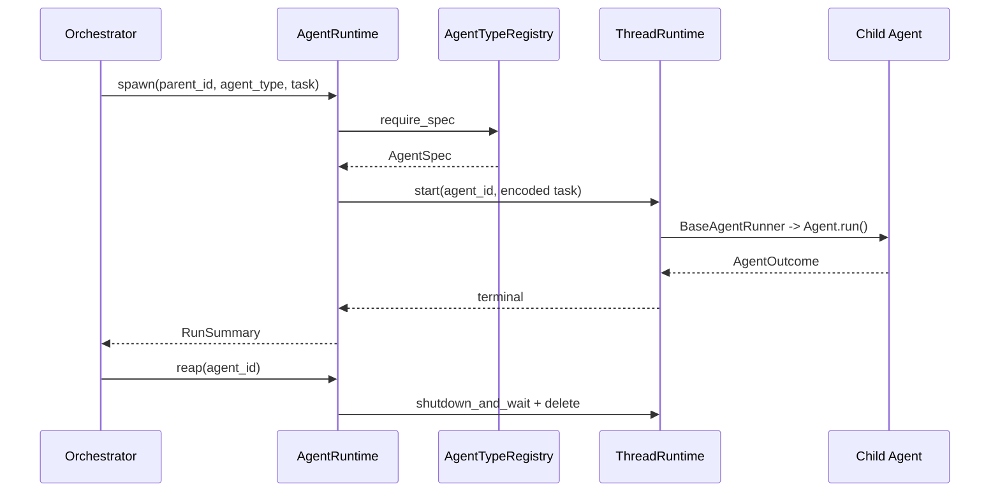

# 4 subagent 流程

## 4.1 定义

子代理是拥有独立 AgentSpec、ThreadRuntime 与记忆的 Agent 实例。子代理由父代理或编排器创建，运行结束后回收。

Python 中没有单独的 `SubAgent` 类。子代理通过 `AgentRuntime.spawn` 创建，或作为一次性 worker 使用 `create_root` / `followup`，运行后调用 `reap`。

## 4.2 Python 子代理

### 4.2.1 创建

`AgentRuntime.spawn(parent_id, agent_type, task)` 位于 `src/athena/core/agent/agent_runtime.py:211-221`。

```python
async def spawn(self, parent_id, agent_type, task, *, name=None):
    if parent_id not in self._records:
        raise AgentCommandError(ErrorCode.NOT_FOUND, f"unknown parent: {parent_id}")
    return await self._spawn_agent(parent_id, agent_type, task, name=name)
```

`_spawn_agent` 实现：

```text
1. 检查 runtime 未关闭
2. 检查 AgentTypeRegistry 包含该类型
3. 生成或使用指定 agent_id
4. registry.require_spec
5. spec.codec.encode_request
6. manager.start(agent_id, req_ref, thread_id=agent_id)
7. 记录 _FacadeRecord（parent_id、path、name、mailbox）
8. _start_run 提交第一个 turn
```

依据：`src/athena/core/agent/agent_runtime.py:223-246`。

### 4.2.2 等待

`wait_run(run_id)` 返回 `RunSummary`。`wait_agent(agent_ids, ...)` 支持 `FIRST_COMPLETED` 或 `ALL_COMPLETED`。

`wait_for(agent_id, target_ids)` 注册持久等待。若目标已终态，则立即返回。`_resolve_agent_waits` 在子代理终态时唤醒父代理。

```python
async def wait_for(self, agent_id, target_ids):
    # 注册等待
    ...
    # 若 target 已终态，立即 resolve
```

依据：`src/athena/core/agent/agent_runtime.py:341-409`、`462-533`。

### 4.2.3 回收

`reap(agent_id)` 递归关闭子代理并删除 Thread 注册，避免一次性 worker 积累。

```python
async def reap(self, agent_id):
    ...
    await self._manager.delete(agent_id)
```

依据：`src/athena/core/agent/agent_runtime.py:555-586`。

### 4.2.4 生命周期



Python 子代理的生命周期如下：编排器调用 `spawn` 后，`AgentRuntime` 从注册表取得规格并启动线程。子代理执行结束后，终态经线程与运行时返回编排器。编排器随后调用 `reap`，显式关闭线程并删除注册。若省略 `reap`，一次性 worker 会持续占用线程资源，因此生产代码中 `reap` 通常位于 `finally` 分支。

### 4.2.5 API 表

| API | 作用 |
|---|---|
| `spawn` | 创建子代理 |
| `followup` | 新 turn |
| `send_message` | mailbox 写入 |
| `wait_run` | 等待单 run |
| `wait_agent` | 等待多个 |
| `wait_for` | 持久等待 |
| `wait_for_human` | 人工等待 |
| `reap` | 删除 |

## 4.3 生产用法

### 4.3.1 EDA workers

`src/athena/research/prepare/eda.py:50-99`。

```text
遍历 TODO
→ spawn eda_worker
→ 等待完成
→ 校验输出
→ finally reap
```

### 4.3.2 Ideator lanes

`src/athena/research/turns/ideator.py:538-644`。

```text
resume_agent
→ send_message 投递 handoff
→ create_root / followup
→ 运行 Ideator
→ 门禁
→ 重试或完成
→ finally reap
```

### 4.3.3 General worker

`src/athena/research/turns/ideator.py:894-946`。

```text
create_root general
→ 运行调研任务
→ 复用 agent_id 做后续 follow-up
→ 完成后回收
```

## 4.4 编排工具

`src/athena/agents/orchestration.py` 提供 LLM 可调用的编排工具：

- `_SpawnTool`：调用 `runtime.spawn`
- `_SendTool`：调用 `runtime.send_message`
- `_WaitForTool`：调用 `runtime.wait_for` 后 `_TurnEnded`
- `_WaitForHumanTool`：调用 `runtime.wait_for_human` 后 `_TurnEnded`

这些工具通过 `RunToolProjector` 注入 Agent turn。当前生产 Supervisor 使用 `SupervisorToolProjector`，未暴露这些编排工具。`[待确认]`

依据：`src/athena/agents/orchestration.py:69-215`。

## 4.5 Rust 子代理

`athena-rust/crates/athena-agent/src/subagent.rs` 提供完整控制平面：

- `AgentControl.spawn`：获取 semaphore permit、创建隔离记忆、spawn tokio task。
- `AgentHandle`：`wait()` / `next_event()` / `cancel()`。
- `send_message`：向运行中的子代理追加消息。
- `interrupt`：通过 `CancellationToken` 取消。
- `SubAgentSink`：事件转发到 handle 与 parent sink。

时序：

Rust 子代理的控制流如下：父方调用 `spawn` 后立即获得句柄，随后通过 `wait` 阻塞。`AgentControl` 在后台启动 tokio 任务，由 `Agent` 完成运行，结果经通道返回给父方。与 Python 不同，Rust 的并发上限由 semaphore 控制，取消由 `CancellationToken` 驱动，事件由 `SubAgentSink` 同时转发给句柄与父事件流。

依据：`athena-rust/crates/athena-agent/src/subagent.rs:33-229`、`tests/subagent.rs:10-51`。

## 4.7 Python 与 Rust 对比

| 方面 | Python | Rust |
|---|---|---|
| 入口 | `AgentRuntime.spawn` | `AgentControl.spawn` |
| 等待 | `wait_run` | `handle.wait` |
| 取消 | `interrupt` | CancellationToken |
| 事件 | ThreadRuntime / rollout | SubAgentSink |
| 生产使用 | 有 | 未接入 |

## 4.8 说明

Python 子代理与普通 Agent 的关键区别不在实现，而在生命周期管理。子代理带父标识与树路径，等待接口更丰富，并且必须显式回收。Rust 子代理则把并发、取消与事件转发纳入独立控制平面。两者都遵循同一原则：子代理不共享父代理的记忆，只通过 mailbox 或通道传递任务与结果。

## 4.9 关键代码路径

### 4.9.1 `_spawn_agent` 内部

```python
async def _spawn_agent(self, parent_id, agent_type, task, *, name, agent_id=None):
    self._check_open()
    if not self._registry.contains(agent_type):
        raise AgentCommandError(ErrorCode.NOT_FOUND, f"unknown agent_type: {agent_type}")
    agent_id = agent_id or uuid4().hex
    spec = self._registry.require_spec(agent_type, agent_id=agent_id)
    req_ref = spec.codec.encode_request(task)
    await self._manager.start(agent_id, req_ref, thread_id=agent_id)
    parent = self._records.get(parent_id)
    path = parent.path + (name or agent_type,) if parent else (name or agent_type,)
    self._records[agent_id] = _FacadeRecord(...)
    run_id = await self._start_run(agent_id, req_ref)
    return agent_id, run_id
```

### 4.9.2 `_start_run` 提交 turn

`_start_run` 将 `req_ref` 作为首个 turn 提交到 ThreadRuntime。ThreadRuntime 的 `submission_loop` 接收 `StartTurn` 后执行 runner。

### 4.9.3 `wait_run` 返回结果

`wait_run` 等待 `_turn_done` future，终态为 `COMPLETED`、`FAILED` 或 `INTERRUPTED`。失败时抛出 `AgentCommandError`。

### 4.9.4 `reap` 递归关闭

`reap` 会关闭当前 Agent 及其所有后代，并从 `_records` 与 ThreadManager 中删除。

## 4.10 边界情况

- 父 Agent 不存在：`spawn` 抛 `NOT_FOUND`。
- Agent 类型未注册：`_spawn_agent` 抛 `NOT_FOUND`。
- 同一 agent_id 重复创建：`create_root` 会复用已有记录，但要求类型一致。
- 一次性 worker 未 reap：会保留 Thread 注册，可能造成资源积累。
- 子代理等待父代理唤醒：`_resolve_agent_waits` 在目标终态后调用 `_wake`。

## 4.11 消息传递

`send_message` 将消息追加到目标 Agent 的 mailbox。`BaseAgentRunner` 在下一 turn 将未读 mailbox 消息以 `[ATHENA MAILBOX MESSAGE]` 信封写入 model memory。

```python
def _append_mailbox_messages(memory, trigger, unread):
    for message in unread:
        if _same_message(trigger, message):
            continue
        payload = {
            "source": message.source,
            "content": message.content,
            "context_refs": message.context_refs,
        }
        memory.append(ModelRequest(parts=[UserPromptPart(content=f"[ATHENA MAILBOX MESSAGE]\n{json.dumps(payload)}")]))
```

## 4.12 证据

| 结论 | 证据 |
|---|---|
| Python spawn/reap | `src/athena/core/agent/agent_runtime.py:211-246`、`555-586` |
| EDA worker | `src/athena/research/prepare/eda.py:50-99` |
| Ideator lane | `src/athena/research/turns/ideator.py:538-644` |
| 编排工具 | `src/athena/agents/orchestration.py:69-215` |

| Rust | `athena-rust/crates/athena-agent/src/subagent.rs:33-229` |
