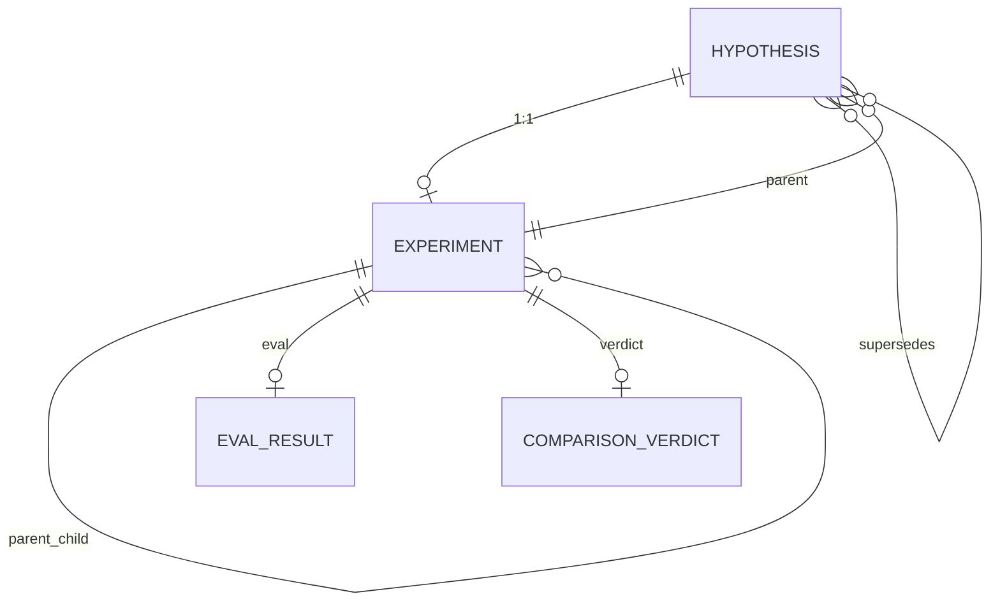
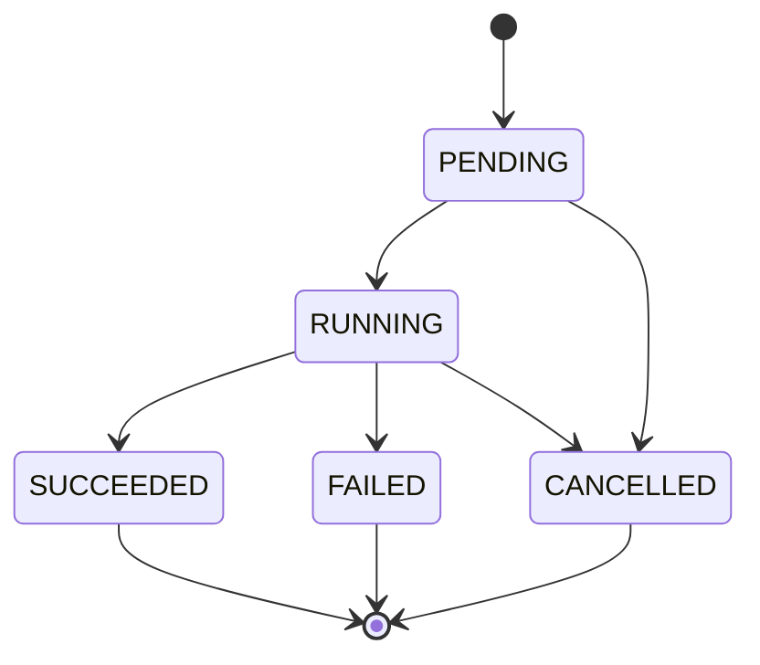

# 5 ResearchTree 设计

## 5.1 定义

`ResearchTree` 是 Athena 的实验图。它保存假设、实验、父子关系与当前最优实验（SOTA）。

- Hypothesis：可证伪的机器学习假设。
- Experiment：单次实验执行记录。
- SOTA：当前最优实验。

`ResearchTree` 是研究过程的事实数据库。它同时服务于 SEARCH 调度、GUI 可视化和最终报告。

## 5.2 核心模型

### 5.2.1 Hypothesis

`Hypothesis` 位于 `src/athena/core/research_models.py:18-42`。

```python
class Hypothesis(BaseModel):
    statement: NonBlankText
    intervention: NonBlankText
    expected_effect: NonBlankText
    status: HypothesisStatus = "PROPOSED"
    evidence_refs: list[ArtifactRef] = []
    id: str | None = None
    parent_id: str | None = None
    supersedes: list[str] = []
    priority: float = 1000.0
    order: int | None = None
    patience: int = 0
    turn_limit: int | None = None
    cost: float = 0.0
    sources: list[str] = []
```

`status` 取值：

```text
PROPOSED
SUPPORTED
REFUTED
INCONCLUSIVE
REJECTED
```

### 5.2.2 Experiment

`Experiment` 位于 `src/athena/core/research_tree.py:38-73`。

```python
class Experiment(BaseModel):
    parent_id: str | None = None
    hypothesis_id: str
    commit: CommitHash
    plan: ExperimentPlan
    gitwork: GitWorkBranch
    status: ExperimentStatus = ExperimentStatus.PENDING
    eval: EvalResult | None = None
    verdict: ComparisonVerdict | None = None
    artifacts: dict[str, ArtifactRef] = {}
    error: str | None = None
```

`status` 取值：

```text
PENDING
RUNNING
SUCCEEDED
FAILED
CANCELLED
```

## 5.3 实体关系

**结论 5.1（一对一约束）**

一个 Hypothesis 最多对应一个 Experiment。`add_experiment` 会拒绝同一 hypothesis 已有实验的情况。

**结论 5.2（parent 语义）**

`Hypothesis.parent_id` 指向父 Experiment ID，而非父 Hypothesis ID。因此形成“父实验 → 子假设 → 子实验”的 lineage。

**结论 5.3（supersedes 语义）**

`supersedes` 只允许指向当前父路径上的祖先假设。子假设可以取代旧假设，但不删除旧节点。



ResearchTree 的实体关系如下：Hypothesis 与 Experiment 之间存在一一对应约束；Experiment 又通过 `parent_child` 自关联形成树结构；Hypothesis 之间的 `supersedes` 表示取代关系；Evaluation 与 Verdict 只能挂在 Experiment 上。理解这一关系是理解 SEARCH 调度与 GUI 可视化的前提：树中的节点是实验，假设挂在实验之下，边既表达血缘，也表达取代。

## 5.4 状态机



Experiment 的合法迁移如下：`PENDING` 可以进入 `RUNNING` 或 `CANCELLED`；`RUNNING` 可以进入 `SUCCEEDED`、`FAILED` 或 `CANCELLED`；终态不允许再次迁移。任何不符合该表的迁移都会被 `transition_experiment` 拒绝。

**结论 5.4（终态约束）**

- `SUCCEEDED` 必须带 `eval`，且 `primary` 有限、`per_sample` 非空。
- 非 `SUCCEEDED` 不能带 `eval` / `verdict`。
- `FAILED` 必须带 `error`。

依据：`src/athena/core/research_tree.py:52-73`。

## 5.5 内部结构

```text
_hypotheses: dict[str, Hypothesis]
_experiments: dict[str, Experiment]
_children_index: dict[str, list[str]]
_sota_id: str | None
```

主要 API：

| 方法 | 作用 |
|---|---|
| `add_hypothesis` | 登记假设，自动分配 id/order |
| `add_experiment` | 登记实验，维护父子索引 |
| `pending_hypotheses` | 返回 `PROPOSED` 假设 |
| `experiment_for_hypothesis` | hypothesis → experiment id |
| `transition_experiment` | 按状态机推进 |
| `complete_experiment` | 写入 eval/verdict/artifacts/commit |
| `set_sota` / `best_experiment_id` | SOTA 管理 |
| `save` / `load` / `to_dict` / `from_dict` | 持久化与重建 |

`add_experiment` 的校验：

```text
1. experiment_id 非空且唯一
2. hypothesis 已知
3. hypothesis 未绑定其他实验
4. parent_id 存在
5. experiment.parent_id == hypothesis.parent_id
```

依据：`src/athena/core/research_tree.py:180-213`。

## 5.6 持久化

- 默认路径：`<project>/.athena/research_tree.json`
- 保存版本：`SAVE_VERSION = 3`
- 可加载版本：`{2, 3}`
- 顶层结构：

```json
{
  "version": 3,
  "sota_id": "exp-...",
  "hypotheses": {},
  "experiments": {}
}
```

`atomic_write_json` 使用 tmp + fsync + `os.replace` 保证原子性。

依据：`src/athena/core/research_tree.py:24-25`、`397-410`、`542-552`；`src/athena/core/persistence.py:9-24`。

## 5.7 GUI 图算法

`src/athena/gui/graph.py` 提供纯函数算法：

- `build_hypothesis_graph`：生成 lineage / supersedes 边。
- `topological_order`：BFS 层序。
- `cycle_detect`：防御性环检测。
- `lineage`：返回祖先链。
- `active_hypotheses`：祖先减去被取代项，再加子假设。
- `descendants`：BFS 后代。
- `best_path`：SOTA 祖先链。
- `rank_pending`：按 priority 排序。
- `supersedes_closure`：传递闭包。
- `refutation_reachability`：证伪影响传播。

GUI 侧对 ResearchTree 有两种读取方式。其一是将树投影为节点与边，交给 ReactFlow 可视化；其二是通过图算法接口返回 JSON 结果。两条路径都只读，不修改树。前端不会直接触碰 `_hypotheses` 等私有字段，而是通过 `to_dict` 与算法函数获取数据，这保证可视化与调度共享同一份事实。

## 5.8 设计原则

1. Supervisor 为唯一写者。
2. Lineage 即搜索历史。
3. Supersedes 表示取代，不删除。
4. SOTA 只能指向成功 baseline/search 实验。
5. GUI 只读。

## 5.9 与 SEARCH 的关系

`ResearchTree` 是 SEARCH 调度的数据基础。Scheduler 从 `pending_hypotheses` 中选取候选，创建 Plan，并将实验结果写回树。Plan 结算时更新 HypothesisStatus、priority 与 SOTA。

`active_hypotheses` 用于计算当前父实验下仍活跃的假设集合：

```text
祖先假设
- 被 supersedes 取代的假设
+ 子假设
```

`experiment_path` 返回从根到某实验的祖先链，供 Plan 冻结上下文使用。

## 5.10 关键代码路径

### 5.10.1 添加假设

```text
add_hypothesis(hypothesis)
→ 生成或校验 id
→ 校验 parent_id 存在
→ 分配 order
→ 校验 supersedes
→ 存入 _hypotheses
→ 返回 id
```

### 5.10.2 添加实验

```text
add_experiment(experiment_id, experiment)
→ 校验 id 唯一
→ 校验 hypothesis 已知
→ 校验 hypothesis 未绑定实验
→ 校验 parent_id 存在
→ 校验 parent 与 hypothesis.parent_id 一致
→ 存入 _experiments
→ 维护 _children_index
```

### 5.10.3 完成实验

```text
complete_experiment(experiment_id, eval, verdict, artifacts, commit)
→ 校验状态为 RUNNING
→ 校验 eval.experiment_id 匹配
→ 写 eval / verdict / artifacts / commit
→ 置 SUCCEEDED
```

依据：`src/athena/core/research_tree.py:342-370`。

## 5.11 关键代码路径

### 5.11.1 `add_hypothesis`

```python
def add_hypothesis(self, hypothesis):
    hypothesis_id = hypothesis.id or new_id("hyp")
    if hypothesis_id in self._hypotheses:
        raise ValueError(f"duplicate hypothesis id: {hypothesis_id}")
    if hypothesis.parent_id is not None and hypothesis.parent_id not in self._experiments:
        raise KeyError(f"unknown parent experiment id: {hypothesis.parent_id}")
    order = hypothesis.order
    if order is None:
        order = max((h.order for h in self._hypotheses.values() if h.order is not None), default=-1) + 1
    ...
    self._validate_supersedes(stored, stored.parent_id)
    self._hypotheses[hypothesis_id] = stored
    return hypothesis_id
```

### 5.11.2 `add_experiment`

```python
def add_experiment(self, experiment_id, experiment):
    # 校验 id、hypothesis、已有实验、parent、parent 一致性
    self._experiments[experiment_id] = experiment
    self._children_index.setdefault(experiment_id, [])
    if experiment.parent_id is not None:
        self._children_index.setdefault(experiment.parent_id, []).append(experiment_id)
```

### 5.11.3 `complete_experiment`

`complete_experiment` 只允许从 `RUNNING` 进入 `SUCCEEDED`，并校验 `eval.experiment_id` 与当前实验一致。

### 5.11.4 `set_sota`

`set_sota` 校验实验状态为 `SUCCEEDED` 且 `plan.kind` 为 `baseline` 或 `search`。

## 5.12 边界情况

- 重复 hypothesis id：抛 `ValueError`。
- 重复 experiment id：抛 `ValueError`。
- 未知 parent：抛 `KeyError`。
- hypothesis 已绑定实验：抛 `ValueError`。
- 父链成环：`_parent_chain` 抛 `ValueError`。
- 终态后再迁移：抛 `ValueError`。

## 5.12 与其他模块关系

- `Supervisor`：唯一写者。
- `Scheduler`：读取 `pending_hypotheses`。
- `PlanLifecycle`：写入 `Experiment`。
- `GuiService`：通过 `tree_get` 输出。
- `Report`：通过 `best_path` 生成报告。

## 5.13 证据

| 结论 | 证据 |
|---|---|
| Hypothesis | `src/athena/core/research_models.py:18-42` |
| Experiment | `src/athena/core/research_tree.py:38-73` |
| 状态机 | `src/athena/core/research_tree.py:76-89` |
| 内部结构 | `src/athena/core/research_tree.py:114-118` |
| add_experiment 校验 | `src/athena/core/research_tree.py:180-213` |
| complete_experiment | `src/athena/core/research_tree.py:342-370` |
| 持久化 | `src/athena/core/research_tree.py:24-25`、`542-552` |
| GUI 算法 | `src/athena/gui/graph.py` |
