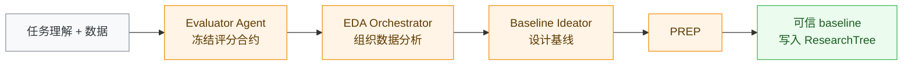
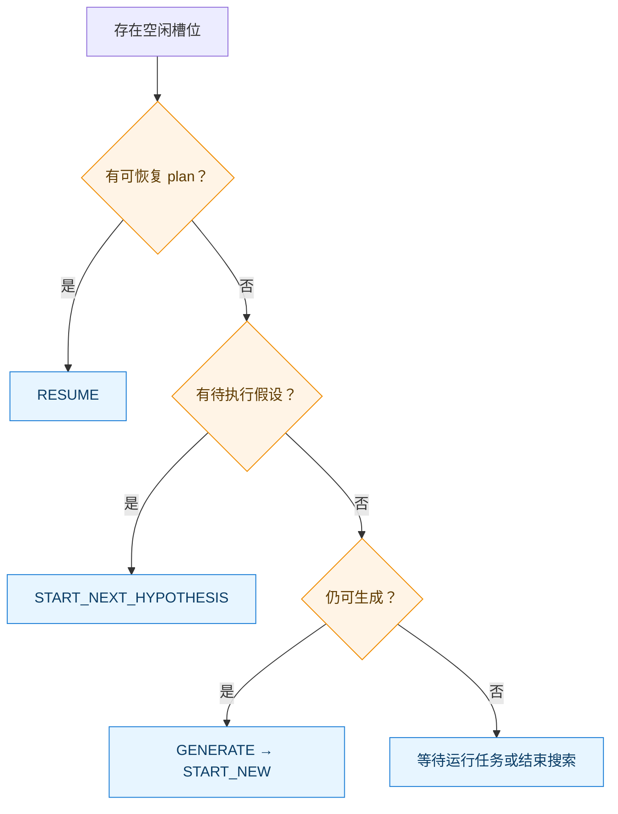

# 6 工作流与阶段职责

Athena 不是把一个长 Prompt 一次性交给模型，而是把研究任务拆成可恢复、可审计的阶段：

```text
未跳过验证：任务理解 → PREPARE → SEARCH → VALIDATE → COMPLETED
启用 `skip_validate`：任务理解 → PREPARE → SEARCH → COMPLETED（SEARCH-only Final）
```

其中，任务理解发生在正式阶段机启动之前；未启用 `skip_validate` 时，阶段机持久化的主流程是 `PREPARE → SEARCH → VALIDATE → COMPLETED`，启用该设置时则从 SEARCH 直接生成 SEARCH-only Final 并进入 `COMPLETED`。每个阶段都应回答四个问题：当前使用哪些已冻结输入，哪些 Agent 可以写什么，什么结果才算完成，以及失败后如何恢复或降级。

## 6.1 总体流程


这张图只展示阶段主干。EDA worker 并发、SEARCH 调度和验证修复循环分别在对应小节展开，避免把不同层级的控制流挤进同一张图。

| 阶段 | 核心问题 | 主要产物 | 进入下一阶段的条件 |
|---|---|---|---|
| 任务理解 | 要解决什么问题，如何判断成功？ | `task_understanding`、澄清记录 | 得到足够明确的任务语义，或使用可解释的回退结果 |
| PREPARE | 数据和指标是否可信，基线能否真实运行？ | 冻结 evaluator、EDA、baseline、`RESEARCH_HANDOFF.md` | baseline 已执行并通过可信评估器计分 |
| SEARCH | 哪个可证伪改动能优于当前 SOTA？ | hypotheses、plan worktrees、实验和评分证据 | 达到搜索上限、人工结束，或进入验证 |
| VALIDATE | 当前 SOTA 能否在冻结上下文中独立复现？ | 验证证据、必要的运行时修复、最终报告 | 独立执行与评分完成 |
| COMPLETED | 哪些结论和产物应交付？ | `ResearchTree`、状态、artifacts、Markdown 报告 | 终态，无后续自动阶段 |

## 6.2 运行时与单写者原则

`ResearchRuntime` 位于 `src/athena/research/runtime/facade.py`，负责组装：

- `LocalArtifactStore`：保存 Prompt 输入、Agent 输出、评估结果和报告等不可变证据；
- `AgentRuntime` 与 `AgentTypeRegistry`：创建并运行不同职责的 Agent；
- `ExecutionRuntime`、`DataScriptRunner` 与 `TrustedEvaluator`：执行代码、数据脚本和可信评分；
- `LocalGitWorkspace`：为 EDA、实验和验证创建隔离工作区；
- `ResearchState`、`ResearchTree` 与事件系统：保存控制状态和研究事实；
- `PhaseRunner`、`AgentTurnRunner` 与 `Supervisor`：推进阶段和 Agent 回合。

`Supervisor` 位于 `src/athena/research/supervisor/supervisor.py`。它是 `ResearchState` 与 `ResearchTree` 的唯一写入者；其他 Agent 通过结构化结果表达建议，不直接修改全局研究状态。

这一边界很重要：Prompt 负责约束 Agent 的思考和交付格式，Supervisor、评估器、Git 工作区与状态模型负责落实可验证的系统约束。

### 6.2.1 Supervisor Agent：长期上下文与控制建议

Supervisor Agent 是贯穿整次研究的长期推理角色，但它不是后台任务执行器。每次被唤醒时，它按以下顺序行动：

1. 调用 `read_state`，确认当前 phase、status、SEARCH 上限和运行模式；
2. 调用 `read_plans`，检查正在运行或等待中的 plan、已用 turn 和剩余预算；
3. 结合用户本轮指导判断这是任务澄清、预算调整、阶段选择还是普通说明；
4. 需要改变系统状态时调用对应确定性工具；
5. 检查工具返回值，只有工具确认成功后才向用户报告状态已改变；
6. 以 `{"answer":"..."}` 结束当前回合。

它可以提出新假设、记录指导、配置 SEARCH、调整等待中 plan 的执行预算或请求阶段转换，但不同动作有不同语义：

- `propose_hypothesis` 创建新的可检验主张，并设置有界 turn 与 patience；
- `record_guidance` 区分“只影响下一个 plan”的建议和“后续持续有效”的约束；
- `update_waiting_plan_budget` 只能增加等待中 plan 的执行机会，不能把原假设替换成新研究方向；
- `configure_search` 修改搜索预算或并发；
- `set_phase_decision` 才能真正从等待状态进入 SEARCH 或 VALIDATE。

Supervisor 的自然语言没有副作用。若工具报错，动作没有发生；它必须修正参数或解释约束，不能在回答中假装已经成功。它也不得启动进程、编辑 workspace、运行 Git、评分、直接写 `ResearchState`、`ResearchTree` 或 `.athena/`。

### 6.2.2 Agent 回合的共同模式

除 Supervisor 外，阶段 Agent 通常遵循相同闭环：运行时冻结输入并创建或恢复 workspace，Agent 使用工具读取与修改自己负责的文件，执行真实命令，然后返回结构化结果；运行时解析结果、执行确定性校验，再决定提交、反馈重试或终止。

因此，“Agent 返回成功”只表示它完成了一个结构化回合，不等于阶段已经完成。阶段完成还可能要求文件存在、manifest 合法、Git diff 非空、可信评分成功、review 接受以及状态持久化。

### 6.2.3 结构化输出契约

| Agent 或角色 | 回合输出 | 运行时如何消费 |
|---|---|---|
| Supervisor Agent | `SupervisorAnswer { answer }` | 展示给用户；状态变化以工具结果为准 |
| Evaluator / Prepare / Plan Agent | `PlanDecision { decision, reason, suggestions }` | 决定继续同一线程、提交当前阶段或放弃 |
| EDA Orchestrator / Worker / Baseline Ideator | `HandoffResult { summary, handoff_file }` | 定位阶段文件并向 UI 发布摘要 |
| Ideator | `HypothesisBatch` 或门禁版 batch | 校验证据与可证伪性后注册幸存假设 |
| Kaggle Handoff Agent | handoff 文件及 notebook/discussion provenance | 缓存为 handoff ref，供后续 Ideator mailbox 使用 |
| Data Agent | `EdaResult { summary }` | 发布动态 EDA 完成信息；实际证据保留在 EDA workspace |
| Validation Agent | `ValidationRepair { explanation }` | 与 workspace diff 一起进入预检和独立 review |
| General Agent | `GeneralResult { result, files? }` | 向 Supervisor 返回具体执行结果，不直接改变研究政策 |

结构化输出解析失败时，运行时通常把 schema 错误作为 follow-up 反馈给原 Agent；不会把无法解析的自然语言自动解释成提交或阶段转换。

## 6.3 启动前：任务理解

### 6.3.1 阶段目的

在数据分析和实验开始前，把用户的自然语言要求收敛为可执行的研究定义，避免后续 Agent 对目标列、任务类型、主指标或成功标准各自猜测。

### 6.3.2 关键输入与输出

输入包括用户任务文本、数据路径、运行模式，以及可选的 Kaggle 竞赛信息。输出写入运行状态和 handoff 引用，核心字段包括：

```text
title, dataset, target, task_type
primary_metric, metric_direction, evaluation_plan
```

未知字段应保持为空并继续澄清，不能为了填满结构而臆测。

### 6.3.3 Prompt 行为与运行时回退

Supervisor Prompt 要求：

1. 先读取当前状态和已有计划，再决定下一步；
2. 首个 PREPARE 回合只做一次 Kaggle 使用决策；
3. 若任务来自 Kaggle，先读取竞赛信息，再使用竞赛定义的准确指标；
4. 只记录一次正式任务理解；
5. 关键事实缺失时一次只问一个问题，优先给出 2～3 个互斥选项；
6. 不直接编辑工作区、启动进程、评分或修改研究树。

GUI 的意图解析允许多轮澄清，并在超时或交互不可用时使用启发式结果回退。回退意味着流程可以继续，不代表缺失事实已经被确认；后续阶段仍应以实际数据和 evaluator 合约校正理解。

任务理解完成后，PREPARE 至少应知道：数据在哪里、预测或研究目标是什么、主要指标如何解释。若目标列或评价方式仍不明确，不能依靠后续实验“碰运气”补全。

## 6.4 PREPARE：建立可信研究起点

PREPARE 的目标不是快速产出一个分数，而是同时建立三种可信基础：不会被实验代码篡改的评分规则、对真实数据的可追溯认识，以及能够实际执行的 baseline。

### 6.4.1 输入、角色与依赖顺序



运行时先冻结 evaluator，再执行初始 EDA；baseline 设计依赖 EDA 结论；Prepare Agent 同时使用已冻结的 evaluator 合约和 baseline 设计。`PhaseRunner` 组织这些步骤，并在成功后让 Supervisor 注册 baseline、设置初始 SOTA。

### 6.4.2 Evaluator：先冻结“怎样算好”

Evaluator Agent 独占一个 evaluator 草稿工作区。它的典型行动顺序是：

1. 运行 `pwd` 确认沙箱根目录，所有文件都用 workspace 相对路径写入；
2. 读取任务和数据来源，识别目标列、任务类型、验证划分与主指标；
3. 若是 Kaggle 任务，先解析 competition slug，调用竞赛接口读取真实 `evaluation_metric` 和数据文件，不能默认使用 accuracy；
4. 从训练数据构造独立验证标签，并为验证行保留原始文件位置形成的 `__athena_row_id`；
5. 编写评分入口与 handoff，明确候选必须预测哪些 ID、写哪个文件、包含哪些列；
6. 构造一份符合合约的示例预测并实际运行 `evaluate.py`；
7. 执行行顺序探针和预测值置换探针；
8. 根据检查结果返回 `continue`、`submit` 或 `abandon`。

它必须生成：

- `metric.json`：声明 `evaluate.py` 等冻结评分入口；
- `evaluate.py`：唯一可信评分入口；
- 带 `__athena_row_id` 的标签数据；
- `HANDOFF.md`：说明预测文件名、列和运行方法；
- `pyproject.toml`：评分环境依赖。

评分必须按显式行 ID 对齐，并拒绝缺失、额外或重复 ID。`evaluate.py` 只能读取 handoff 指定的单个预测文件，stdout 必须恰好输出一行 `{"primary": <float>}`；诊断信息写入 stderr。不能把 `predictions/` 下所有 CSV 拼接后评分，也不能截断真实值和预测值来掩盖行数不一致。

两类 sanity probe 的含义分别是：只打乱预测文件的行顺序而保持 ID—预测值对应关系时，分数必须不变；保持 ID 位置不变但在 ID 之间置换预测值时，分数必须变化。前者验证“没有按位置评分”，后者验证“指标确实使用了预测值”。

Prompt 允许 Agent 用 `continue` 修正 evaluator，用 `submit` 提交可冻结版本，用 `abandon` 放弃。运行时会拒绝无效决策或冻结失败，只有成功冻结的 evaluator 才能交给后续阶段。冻结后，实验 Agent 不应接触最终标签，也不能自行替换评分逻辑。

### 6.4.3 EDA Orchestrator：规划与汇总，不代替 worker

EDA Orchestrator 是同一个 Agent 的两次回合。

第一回合只负责规划：

1. 读取任务、workspace 与数据文件布局；
2. 判断 tabular、image、text、timeseries 或 mixed 模态；
3. 按“概览—独立画像—关系与风险—最终汇总”拆分任务；
4. 为每项任务指定唯一的 `EDA_REPORT_*.md`；
5. 在 `EDA_TODO.md` 中显式标记阶段是否允许并行；
6. 返回 `{"summary":"...","handoff_file":"EDA_TODO.md"}`，不在此回合抢先写分析报告。

todo runner 执行全部 worker 后，运行时恢复同一个 orchestrator 进入第二回合。此时它读取所有已生成报告，交叉检查结论是否一致，把报告目录与摘要写入 `EDA_INDEX.md`，再把 baseline 真正需要的统计结论压缩到 `EDA_HANDOFF.md`。它不应重新做一遍 worker 的全部分析，也不能用汇总文字掩盖失败任务。

### 6.4.4 EDA Worker：单任务、单报告、真实数值

每个 EDA Worker 只接收 `EDA_TODO.md` 中的一项任务，并且只拥有对应报告文件。单个 worker 的行为是：

1. 读取任务、真实数据以及完成该主题所必需的已有报告；
2. 编写或运行所需的分析脚本，而不是只凭列名推测；
3. 报告与主题相关的具体行数、比例、分布、缺失率、基数、相关性、信息增益、泄漏或漂移风险；
4. 给每条关键发现分配稳定的 `eda:<report>:<id>`；
5. 只创建或覆盖分配给自己的那一份报告；
6. 返回报告文件名和一句话摘要。

worker 可以读取其他报告来避免矛盾，但不能修改它们；也不能修改原始数据、evaluator、baseline 或框架状态。同阶段标记为 `parallel: true` 的任务最多并行三个 worker，非并行阶段则逐项执行。

第二回合生成的 `EDA_HANDOFF.md` 应包含数据规模、目标与切分风险、关键特征、主要质量问题、最多五条可引用的 `eda:` 证据，以及对 baseline 的具体建议。

失败任务默认重试；仍失败时保留未完成状态并触发 fallback。即使 EDA 不完整，系统也应明确记录缺失分析，而不是把推测伪装成已验证发现。完整文件契约、任务调度和动态补充机制见 [12 EDA 系统设计](12-eda-system.md)。

### 6.4.5 Baseline Ideator：设计而不代替实现

Baseline Ideator 根据任务、evaluator 合约和 `EDA_HANDOFF.md` 设计一个主方案，最多附带两个备选方案。主方案应覆盖：

- 模型骨干、特征和预测头；
- 损失函数、优化器与训练策略；
- 数据增强或预处理；
- 验证策略与主指标；
- 实施步骤、资源需求、风险和回退方法；
- 使用的先验依据和 `eda:` 引用。

它的行动顺序是先读 `EDA_HANDOFF.md`，再沿 handoff 中最重要的 `eda:` 引用回看原报告，然后结合任务模态和可实现的先验知识选择主架构。它必须把主方案写到足够让 Prepare Agent 直接编码的粒度，包括输入如何变换、模型各组件怎样连接、训练目标、验证方式和失败后的备选路径。

它只生成 `BASELINE_DESIGN.md`，不执行训练，不输出预测，不提出 SEARCH 阶段的研究假设，也不编造 disconfirmer 或未经运行的提升数值。回合以 `{"summary":"...","handoff_file":"BASELINE_DESIGN.md"}` 结束。

### 6.4.6 Prepare Agent：实现、运行并交接 baseline

Prepare Agent 必须检查真实数据，并尽量严格实现 baseline 主方案。它需要：

1. 运行 `pwd` 并检查真实数据；外部数据只能通过绝对路径的 shell 命令读取或复制，文件工具仍限制在 workspace 内；
2. 优先读取并实现 `BASELINE_DESIGN.md` 的主架构，只有主方案无法运行时才切换到已记录的 alternative；
3. 创建可维护的多文件解法，而非只留下说明性代码；
4. 安装依赖到共享 `$ATHENA_ENV_ROOT`，不在工作区创建私有虚拟环境；
5. 生成有效的 v1 `experiment.json`，`commands` 必须是 argv 数组列表，Python 可执行文件写裸 `python`；
6. 使用 workspace 相对路径声明 `outputs.predictions` 和 Markdown report；
7. 实际运行 baseline，读取失败输出并持续修复，不能只做静态检查；
8. 清理 smoke test 或 scratch 预测，只保留 evaluator 合约指定的一份文件；
9. 写出 `RESEARCH_HANDOFF.md`，再返回结构化 PlanDecision。

`RESEARCH_HANDOFF.md` 至少应记录指标、验证行数和划分方式、报告路径、准确的 argv 命令、共享环境解析方式、评分入口、关键文件、已知限制和后续改进方向。若主方案不可行，Agent 可以采用设计文档中的备选方案，但应说明触发回退的原因。

Prepare Agent 不得创建 evaluator、标签或 `metric.json`，不得把分数、标签路径、Git 命令、绝对路径或父目录路径塞入 `experiment.json`，也不得自己运行 Git。`continue` 表示留在 PREPARE 修复具体缺陷；`submit` 才表示 baseline 已准备好并请求进入 SEARCH；`abandon` 表示在预算内无法得到可信 baseline。

### 6.4.7 PREPARE 的完成与降级条件

PREPARE 只有在 baseline 已真实执行、预测文件符合 evaluator 合约、可信评分成功且必要证据齐全时才能进入 SEARCH。运行时还会检查提交类型、commit、predictions、report、metric 等关键字段。

EDA 可以在明确记录失败的前提下降级，baseline 设计也可能被跳过；但 evaluator 与可评分 baseline 不是可选装饰。没有可信起点，SEARCH 中的“提升”就没有比较基准。

## 6.5 SEARCH：在预算内提出并检验可证伪改动

SEARCH 不是自由发散的代码生成循环。它以冻结 evaluator、当前 SOTA、EDA 证据和 `RESEARCH_HANDOFF.md` 为边界，反复执行“提出假设—实施单一干预—可信评分—结算证据”。

### 6.5.1 阶段输入与角色

| 角色 | 读取 | 主要输出 | 不允许做的事 |
|---|---|---|---|
| Kaggle Handoff Agent | baseline handoff、EDA、竞赛社区内容 | `KAGGLE_HANDOFF.md`、`KAGGLE_EVIDENCE.json` | 直接提出最终假设或修改 baseline |
| Ideator | handoff、EDA、baseline、当前树、可选语料库 | 1～5 个可证伪假设，可选 `eda_request` | 修改 evaluator、baseline 或实验工作区 |
| Methodology / Statistics Reviewer | 单个结构化候选 | 独立风险报告 | 修改候选或读取实验 workspace |
| Scheduler | 预算、并发、假设与 plan 状态 | `RESUME`、`START_NEXT_HYPOTHESIS`、`START_NEW`、`GENERATE` | 直接执行实验或改变评分 |
| Plan Agent | 单个冻结假设、父方案、evaluator handoff、反馈 | 代码改动、实验清单、预测、报告、结构化决策 | 控制其他 plan 或直接修改 ResearchTree |
| Data Agent | 一个具体 `eda_request`、已有 EDA 与 handoff | 追加发现、脚本和图表 | 重写已有报告或改变实验配置 |
| Supervisor | Agent 结果与可信评分证据 | 状态结算、优先级、SOTA 更新 | 绕过验证器接受自报分数 |

### 6.5.2 Kaggle Handoff Agent：可选的社区证据收集

仅当 Supervisor 已启用 Kaggle 且任务能解析出 competition slug 时，SEARCH 才会按需创建这个 Agent。它不会直接产生最终假设，而是为所有 Ideator 准备共享证据：

1. 先读取 `RESEARCH_HANDOFF.md` 和必要的 EDA 内容，理解 baseline 指标、方法和短板；
2. 枚举热门 discussions，打开与当前短板最相关的 2～5 个线程；
3. 枚举高价值 notebooks，实际读取 2～5 个 notebook 的源码和版本；
4. 提取社区已知陷阱、失败尝试、可复用技巧和能够落地为实验的方向；
5. 写 `KAGGLE_HANDOFF.md`，并用 `KAGGLE_EVIDENCE.json` 保存打开过的 notebook/discussion 精确 provenance；
6. 返回 handoff 文件、摘要和来源清单。

它只能写这两个 handoff 文件，不能修改 EDA、baseline、预测或实验清单。引用必须来自实际打开的来源，notebook 使用 `notebook:<ref>@<version>`，discussion 使用 `discussion:<ref>`。如果该 Agent 失败、工具不可用或没有产出文件，运行时记录错误后继续 Idea Generation；Kaggle 社区证据是增强通道，不是 SEARCH 的硬前提。

### 6.5.3 Ideator：假设必须可执行、可观察、可否证

每个 Ideator lane 是一次性研究线程。运行时先把任务澄清、Kaggle handoff 等文本投递到 mailbox，再给它冻结 evaluator handoff、EDA workspace 和可选论文语料库。单个 lane 的行动顺序是：

1. 首先读取 `RESEARCH_HANDOFF.md`，确认 baseline 分数、运行方法、关键文件和已知限制；
2. 按需回看 EDA、baseline 源码和结果，理解已经尝试过什么；
3. 阅读 mailbox 中的任务澄清与 Kaggle 证据；
4. 若存在论文语料库，先查看目录，再搜索 chunk，并通过 `paper_chunk_read` 真正打开相关正文；
5. 生成当前 lane 配额内的候选，并把最强候选排在第一位；
6. 返回结构化 hypotheses 和可选 `eda_request`，不修改 workspace；
7. lane 结束后由运行时回收线程，避免跨轮残留对话污染。

每个假设都应包含：

- 清晰的陈述，以及相对当前方案的精确干预；
- 预期影响及其方向；
- 来自真实读取材料的前提和引用；
- 可测量的预测观察；
- 会否定该假设的结果；
- 实际打开过的来源，而不是装饰性参考文献。

不同 lane 可以采用 exploit、bold 或 moonshot 风格，但风格只改变改动幅度，不降低证据要求：

- Exploit 从 baseline 缺陷出发，可调参、修复问题或替换一个组件；每批至少包含一个组件级改动；
- Bold 不锚定现有方案，可替换主要组件或整个系统；每批至少包含一个明确命名的完整架构替换；
- Moonshot 忽略 baseline 的结构，从第一性原理提出 1～3 个新系统，必须说明模型族、数据表示、训练范式或端到端管线的具体变化。

Ideator 可以引用先验、EDA、baseline、Kaggle 或论文，但不能虚构 ref。论文 `sources` 还会被运行时复核：未通过 `paper_chunk_read` 打开的论文 ID 会被删除；对已读正文与主张的支持关系也会额外检查。

若当前 EDA 不足以支撑判断，Ideator 可以提出具体 `eda_request`。该请求不会追溯性改变本轮已经生成的假设，其新增证据从下一轮 Ideator 开始生效。

### 6.5.4 假设审阅角色：生成与评审分离

在默认 `ideageneration` 模式下，Ideator 的输出不会直接进入 `ResearchTree`。每个候选先经过确定性结构检查和可证伪性审计，再由两个相互独立的单轮审阅角色并行评估：

- Methodology Reviewer 只检查对照组、混杂变量、相关与因果混淆，以及 intervention 是否可实际执行；它不讨论统计功效或论文一致性；
- Statistics Reviewer 只检查样本量与功效、多重比较、预期效应是否高于噪声，以及观察量能否量化；它不评价架构选择。

审阅输入不包含 Ideator 的自信分数，避免生成者的主观概率影响评审。每个 reviewer 输出 critique、尚未解决的风险以及是否存在不可修复的致命问题。调用失败会变成 `failed=True` 的审阅报告，不会被当成通过。

随后系统生成最小验证计划并执行 light hard gate。通过或被标记为 exploratory 的候选才能进入假设池；`REVISE` 或 `REJECT` 候选在本轮被丢弃。若一个 lane 的候选全部被拒绝，运行时把逐项 blocking reason 反馈给同一个 Ideator 重新生成，直到通过、没有可修正理由或达到固定重试上限。

这些 reviewer 是受结构化 schema 约束的独立模型调用，不是拥有 workspace 和长期 mailbox 的持久 Agent。这个区别决定了它们只能给审阅意见，不能修改候选或研究状态。

`--ideation` 还保留两种非默认模式。`baseline` 直接把普通 Ideator 输出注册到假设池，用作不经过门禁的消融对照；`debate` 使用 proposal → review → revision → judge 流程：多个 debater 先独立提案，再交叉审阅并根据意见修订，最后由 judge 从冻结上下文和辩论记录中选出 3～5 个候选。辩论角色保留各自线程历史，但仍只输出结构化候选，最终注册和排序继续由 Supervisor 与 `ResearchTree` 完成。

### 6.5.5 Scheduler：先续跑，再填充新工作

`Scheduler` 位于 `src/athena/research/supervisor/scheduling.py`，根据 `concurrency`、`search_limit`、已有假设和 plan 状态选择动作：



`SearchLoop` 维护正在运行的任务，并通过 `asyncio.wait(..., FIRST_COMPLETED)` 在任一 plan 完成后立即补槽，因此并发表示多个隔离实验同时推进，不表示多个 Agent 可以同时写全局状态。

### 6.5.6 Plan Agent：一次只验证一个冻结假设

`PlanLifecycle` 为每个 plan 冻结 `PlanInput`、从父实验创建独立 Git worktree、注册 `RUNNING` 实验，然后启动 Plan Agent。Plan Agent 的每个回合必须：

1. 读取冻结假设、父方案、evaluator handoff、Git status、历史执行和可信评分反馈；
2. 明确当前回合是首次实现、修复运行失败，还是基于可信分数继续优化；
3. 修改 solution 源码，实施假设描述的精确 intervention；
4. 保持 v1 `experiment.json` 可复现并严格遵守预测 ID、行集合和单文件合约；
5. 实际运行命令，定位错误并在 turn 与执行预算内修复；
6. 检查预测和报告产物，删除继承或调试遗留的额外预测文件；
7. 只返回符合 `PlanDecision` schema 的 JSON。

继承父方案但没有形成实质差异的结果会被运行时标记为 `no_change`，不会执行测量。Agent 自报的分数不进入研究树；只有 `TrustedEvaluator` 对冻结 evaluator 的评分才参与结算。若 manifest、命令、预测、报告或评分失败，runner 把具体错误作为下一回合反馈，而不是让 Agent 自行修改全局实验状态。

`continue` 表示当前假设值得再做一次可信评估或修复；`submit` 表示用该 plan 历史上最好的可信 revision 结算，不一定是“最后一次文件状态”；`abandon` 表示停止这个假设。Agent 可以留下后续建议，但不能注册新假设、调度其他 plan 或改变预算。

结算时，Supervisor 更新实验状态、假设优先级和 SOTA。这样即使多个 plan 并发完成，全局事实仍按单写者路径顺序落盘。

### 6.5.7 Data Agent：只追加本轮缺失证据

同一轮多个 lane 的 `eda_request` 会先被汇总，再交给 Data Agent。它每次只处理一个具体问题，行动顺序是：

1. 先读已有 EDA 和 `RESEARCH_HANDOFF.md`，确认数据位置、命名和已有分析；
2. 若请求已经有答案，避免重复计算并在摘要中指出已有证据；
3. 编写一个小型脚本，只使用 `numpy`、`pandas` 和 `matplotlib`；
4. 运行脚本并修复到成功；
5. 将图片以清晰标题、坐标标签和相对路径保存到 `figures/`，优先使用 300 dpi；
6. 在已有报告末尾追加 `## Additional EDA: <request>`，写入 1～3 条带具体数值的发现；
7. 返回一句话摘要，说明新增了什么分析以及写入哪个 section。

动态 EDA 只允许追加，不得修改原始数据、冻结 evaluator、baseline、预测文件或实验配置；还应先检查已有报告，避免重复初始 EDA 已完成的分析。详细时序见 [12 EDA 系统设计](12-eda-system.md)。

### 6.5.8 SEARCH 的停止、等待与人工决策

SEARCH 完成后的路径由两个独立设置决定。项目级 `skip_validate` 默认关闭，并在同一项目的
GUI sessions 间共享；它打开时优先于 `auto_validate`：

| `skip_validate` | `auto_validate` | SEARCH 完成后的策略 |
|---|---|---|
| `true` | 任意值 | 跳过独立 VALIDATE evaluator，写入仅基于 SEARCH SOTA 的 Final 报告并进入 `COMPLETED`；没有 final-test 分数或 generalization gap |
| `false` | `true` | 自动进入 `VALIDATE`，完成独立复验后进入 `COMPLETED` |
| `false` | `false` | 保留人工验证门禁；交互运行可停在 `WAITING`，等待用户 Continue 或其他阶段决策 |

开启跳过策略时，系统仍会保留 SEARCH 的可信 SOTA 评分作为参考，但不会伪造最终评估指标。
报告会明确标注 `VALIDATE` 已跳过。保存设置不会自动推进已经停在 `SEARCH/WAITING` 的运行，
该运行需要用户点击 Continue；已经进入 `VALIDATE` 的运行也会继续现有验证流程，即使之后打开
`skip_validate`。后端没有新增 FINAL phase，跳过后的终态仍是现有的 `COMPLETED`。

这三种选择必须通过确定性控制工具修改状态；Supervisor Agent 不能只在自然语言里宣布“已增加预算”或“已开始验证”。

## 6.6 VALIDATE：在冻结 SOTA 上独立复验

当项目未启用 `skip_validate` 且选择自动或人工验证时，VALIDATE 的目标不是继续调参，而是确认
SEARCH 选出的 SOTA 在独立工作区、冻结输入和可信 evaluator 下仍然能够运行并取得一致方向的结果。
启用跳过策略的运行不会进入本节流程；它直接从 SEARCH 生成明确未验证的 Final 报告。

### 6.6.1 冻结输入

进入验证时，系统形成 validation key，至少绑定：

- SOTA commit；
- SEARCH 中记录的参考指标和方向；
- evaluator 引用；
- 验证工作区与已有证据。

这些内容共同定义“正在验证哪个结果”。验证过程中不能悄悄换成另一个实验、指标或评估器。

### 6.6.2 Validation Agent 的修复边界

Validation Agent 运行在从 SOTA commit 创建的独立验证 workspace 中。它不是第二个 Plan Agent，也不负责寻找更高分方案。每个修复回合按以下顺序行动：

1. 读取冻结的 SOTA 上下文、v1 `experiment.json`、当前 workspace 和上轮 review 反馈；
2. 复现运行失败，定位是依赖、路径、设备、随机性还是序列化问题；
3. 只做让原方案按既定语义运行所需的最小改动；
4. 保持 manifest 使用 argv commands，并保留原有 predictions 输出路径；
5. 再次检查改动没有改变研究干预；
6. 返回且只返回 `{"explanation":"..."}`，逐项解释为什么每个变化属于 runtime-only repair。

允许修复的问题例如：

- 依赖声明或命令路径错误；
- CPU/GPU 设备选择不兼容；
- 随机种子或确定性设置缺失；
- 模型、预测或中间结果的序列化问题。

它不能修改模型架构、特征、预处理语义、超参数、训练行为或 evaluator，也不能访问最终标签。若没有必要修改，也应明确说明当前 workspace 无需 runtime repair，而不是制造一个无意义 diff。

### 6.6.3 审查、执行与评分


运行时先做确定性预检，检查修改路径和内容是否明显越过 runtime-only 边界；预检拒绝时，具体原因会反馈给同一个 Validation Agent 修订。

预检通过后，系统把冻结 SOTA 摘要、Agent explanation 和完整文本 diff 交给独立 Validation Diff Reviewer。Reviewer 只返回 `accepted` 与 `reason`：它需要判断每一处改动是否被 explanation 覆盖、是否仅修复运行问题，以及是否暗中改变模型或训练语义。二进制 diff、无法安全读取的 diff 或无解释的修改会直接拒绝。

只有 review 接受的精确 diff 才能执行。预测生成后，运行时再次比较 workspace diff；若执行过程又改写了源码或配置，就以“review 后 workspace 发生变化”为由重试。之后 `TrustedEvaluator` 才使用冻结评分包计分，最后提交的也必须是已经审查过的同一份 diff。

若修复被拒绝或执行失败，系统可在固定预算内反馈重试；重试不能借机扩大为模型改造。

### 6.6.4 完成条件与最终输出

验证执行、可信评分和证据保存完成后，`PhaseMachine` 生成最终报告引用，并把状态推进为 `COMPLETED`。最终交付包括：

- 完整 `ResearchTree`，包含 hypotheses、experiments 和 SOTA 演化；
- `state.json` 与断点恢复信息；
- evaluator、EDA、各实验和验证工作区；
- 评分、review、运行日志等 artifacts；
- 由 `src/athena/research/report.py::build_final_report` 生成的 Markdown 报告。

对于 Kaggle 任务，只有进入 `COMPLETED` 后，Supervisor 才能调度通用 worker 提交预测。未启用
`skip_validate` 的路径不得在 VALIDATE 之前把中间预测当作最终提交；启用跳过策略的路径也只能
在 SEARCH 完成并进入 `COMPLETED` 后提交，不能把 SEARCH 中间结果当作最终提交。

若 `skip_validate=true`，最终报告和状态仍按上述终态交付，但验证结果明确为缺失：报告只引用
SEARCH SOTA，不包含 final-test 分数或 generalization gap；`resume.json` 会记录
`validation_skipped=true`，以便之后按运行历史准确重建报告。该记录不把 `COMPLETED` 变成新的 FINAL phase。

### 6.6.5 General Agent：完成后的受限执行者

General Agent 不参与假设生成、SOTA 选择或阶段决策。它只在 Supervisor 给出具体任务时执行通用工作；workflow 中最重要的用途是 Kaggle 任务在 `COMPLETED` 后提交最终预测。

它会先读取明确任务和项目现状，再使用文件、shell 或 Kaggle 工具完成操作，处理非零退出并验证结果，最后返回 `{"result":"...","files":[...]}`。它可以报告提交结果和相关文件，但不能读取或修改冻结标签与 evaluator，不能决定哪个实验是 SOTA，也不能改变 phase、预算或研究树。未启用 `skip_validate` 时，提交动作必须以 VALIDATE 已产生可信结果为前提；启用跳过策略时，则必须以 SEARCH 已完成并已进入 `COMPLETED` 为前提。

## 6.7 持久化与恢复

Athena 将“控制状态”和“研究事实”分开保存：

```text
.athena/
├── state.json
├── resume.json
├── research_tree.json
├── artifacts/
└── workspaces/
```

- `state.json` 保存当前 phase、status、预算、并发和 plan 摘要；
- `resume.json` 保存 Agent 会话等断点字段，并带核心状态摘要，防止把旧断点加载到新状态；
- `research_tree.json` 保存可审计的假设、实验、评分证据和 SOTA；
- `artifacts/` 保存不可变输入输出；
- `workspaces/` 保存不同职责的隔离 Git 工作区。

`ResearchState` 的主要字段位于 `src/athena/research/supervisor/state.py`：

```text
status, phase, search_limit, concurrency
ideator_count, hypotheses_per_ideator, manual_mode
plans, validation, eda_dir, evaluator_ref
task_understanding, task_text, handoff_sources, handoff_refs
corpus_ref, corpus_ideated_ref, kaggle_download
```

GUI 的 `skip_validate` 偏好保存在网关状态的项目键映射中，不写入研究 checkpoint；同一项目的
不同 session 和 GUI 重启会读取同一个值。运行是否实际跳过验证则以该次运行的
`resume.json` 中的 `validation_skipped` 为准，因此修改当前项目偏好不会改变历史已完成报告。

状态保存但研究树尚未落盘的崩溃窗口由 recovery 逻辑修复；`state.json` 与 `resume.json` 摘要不一致时，过期的 resume 数据会被忽略。

## 6.8 事件与前端呈现

```text
Supervisor / Agent
        ↓
RuntimeEvents
        ↓
CLI renderer / TUI / GUI WebSocket
```

运行时主要发送两类事件：

```json
{"kind": "state", "data": {"phase": "SEARCH", "status": "RUNNING"}}
{"kind": "output", "data": {"source": "plan", "channel": "analysis", "text": "..."}}
```

CLI 将事件渲染为文本行，GUI 通过 WebSocket 推送 JSON，TUI 根据相同事件更新界面。前端只消费状态与输出，不参与阶段判定，因此不同界面不会改变后端研究语义。

## 6.9 阶段转换表

| 当前阶段 | 当前状态 | 下一状态或阶段 | 触发条件 |
|---|---|---|---|
| PREPARE | `RUNNING` | SEARCH / `RUNNING` | evaluator 已冻结，baseline 已执行、评分并写入研究树 |
| SEARCH | `RUNNING` | SEARCH / `RUNNING` | 仍有预算和可调度动作 |
| SEARCH | `RUNNING` | SEARCH / `WAITING` | 交互模式预算耗尽，等待用户决策 |
| SEARCH | `RUNNING` | `COMPLETED` | `skip_validate=true`，生成仅基于 SEARCH 的未验证 Final 报告 |
| SEARCH | `RUNNING` | VALIDATE / `RUNNING` | `skip_validate=false` 且自动验证或人工触发验证 |
| VALIDATE | `RUNNING` | COMPLETED | 独立执行、可信评分、证据和最终报告均已保存 |

## 6.10 常用命令

```bash
uv run Athena-cli run --project .athena/run --data examples/titanic/train.csv --task "预测存活" --mode auto
uv run Athena-cli status --project .athena/run
uv run Athena-cli pause --project .athena/run
uv run Athena-cli resume --project .athena/run
uv run Athena-cli stop --project .athena/run
```

## 6.11 开发者从哪里开始修改

| 修改目标 | 首要入口 | 同时检查 |
|---|---|---|
| 改 Supervisor 的询问或工具选择 | `src/athena/agents/prompts/supervisor_agent.md` | Supervisor tools、结构化 `SupervisorAnswer`、phase 状态约束 |
| 改阶段顺序或转换条件 | `src/athena/research/supervisor/phases.py` | `runtime/phase_runner.py`、状态恢复、阶段测试 |
| 改 PREPARE 子步骤 | `src/athena/research/prepare/orchestrator.py` | evaluator/EDA/baseline/prepare Prompt 与产物契约 |
| 改 evaluator 产物或行为 | `src/athena/agents/prompts/evaluator_agent.md` | evaluator freezer、`TrustedEvaluator`、handoff 解析 |
| 改初始 EDA Agent | `src/athena/agents/prompts/prepare_eda_agent.md`、`src/athena/agents/prompts/eda_worker_agent.md` | `prepare/eda.py`、`prepare/orchestrator.py`、第 12 章文件契约 |
| 改 baseline 设计或实现 | `src/athena/agents/prompts/baseline_ideator_agent.md`、`src/athena/agents/prompts/prepare_agent.md` | manifest、Prepare runner、可信评分与 handoff |
| 改假设生成要求 | `src/athena/agents/prompts/ideator_gated_agent.md` 及三种 lane Prompt | 假设 schema、门禁和 `turns/ideator.py` |
| 改假设审阅 | `src/athena/research/idea_generation/prompts.py` | review schema、gatekeeper、失败降级语义 |
| 改 SEARCH 调度 | `src/athena/research/supervisor/scheduling.py` | `search_loop.py`、预算与并发测试 |
| 改单个实验生命周期 | `src/athena/research/supervisor/plan_lifecycle.py` | Plan Prompt、runner、可信评分与结算逻辑 |
| 改动态 EDA | `src/athena/research/turns/ideator.py` | Data Agent Prompt、EDA 文件契约 |
| 改验证修复边界 | `src/athena/agents/prompts/validate_agent.md` 与 `supervisor/validation.py` | preflight、review、diff 不变性、评分测试 |
| 改持久化字段 | `src/athena/research/supervisor/state.py` | resume 摘要、迁移与 recovery |
| 改最终报告 | `src/athena/research/report.py` | validation 结果和 artifact 引用 |

修改 Prompt 时，必须同步检查结构化输出模型和运行时消费者。仅在 Prompt 中增加一句要求，并不等于系统已经强制执行；如果该要求影响正确性、隔离性或评分可信度，应同时加入确定性校验和回归测试。

## 6.12 关键代码路径

```text
src/athena/research/runtime/facade.py
src/athena/research/runtime/phase_runner.py
src/athena/research/turns/ideator.py
src/athena/research/report.py
src/athena/research/supervisor/supervisor.py
src/athena/research/supervisor/phases.py
src/athena/research/supervisor/search_loop.py
src/athena/research/supervisor/scheduling.py
src/athena/research/supervisor/plan_lifecycle.py
src/athena/research/supervisor/state.py
src/athena/agents/prompts/
```

相关章节：

- [2 应用与服务层](02-app-server.md)
- [8 假设生成与研究树](08-idea-generation.md)
- [10 论文检索与证据引用](10-paper-research.md)
- [11 Evidence、Artifact 与 TODO](11-evidence-and-todo.md)
- [12 EDA 系统设计](12-eda-system.md)
