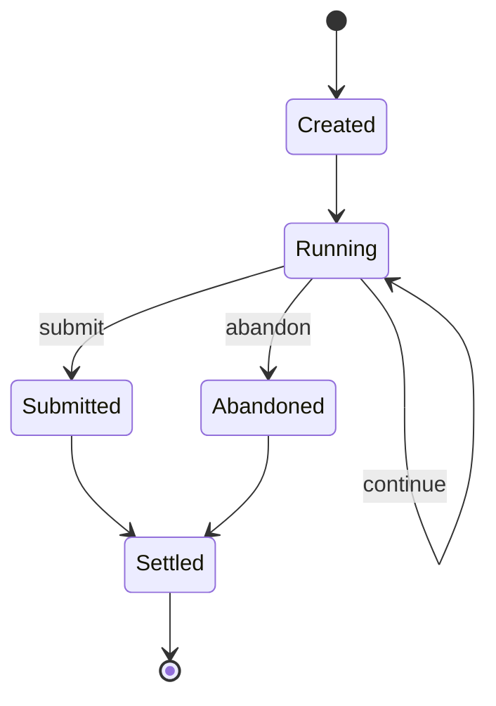
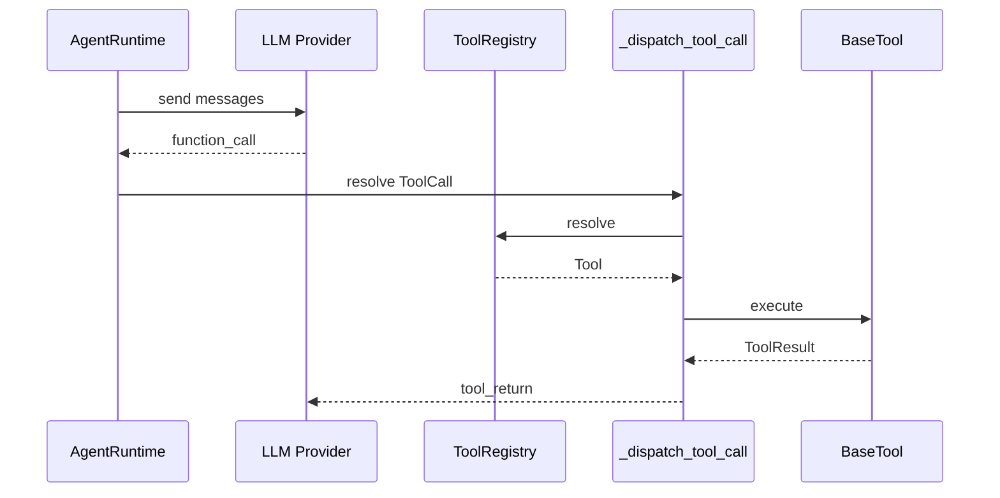

# 7 树搜索过程与 Tool 机制

## 7.1 定义

树搜索是在 `ResearchTree` 上，以预算与并发为约束，通过 Scheduler 调度实验，用真实评估结果更新优先级与 SOTA 的迭代过程。

## 7.2 Scheduler Action

`ScheduleKind` 定义于 `src/athena/research/supervisor/scheduling.py:20-26`。

```python
class ScheduleKind(str, Enum):
    RESUME = "RESUME"
    START_NEW = "START_NEW"
    START_NEXT_HYPOTHESIS = "START_NEXT_HYPOTHESIS"
    GENERATE = "GENERATE"
```

| Action | 含义 |
|---|---|
| `RESUME` | 恢复未完成 Plan |
| `START_NEW` | 从排队假设创建新 Plan |
| `START_NEXT_HYPOTHESIS` | 用户点名假设 |
| `GENERATE` | 请求 Ideator 生成新假设 |

## 7.3 槽位填充

`Scheduler.next_actions` 位于 `src/athena/research/supervisor/scheduling.py:106-169`。

```text
free_slots = concurrency - len(running)

1. 仅 SEARCH phase 有效
2. RESUME 未完成 Plan
3. human_next 优先
4. START_NEW（auto 模式，按 Selector 排序）
5. GENERATE（剩余空位）
```

预算：

```text
count_search_attempts = 已终态 search 实验数 + 活跃 SEARCH Plan 数
create_budget = search_limit - count_search_attempts
```

依据：`src/athena/research/supervisor/scheduling.py:70-78`、`106-169`。

## 7.4 Plan 生命周期



Plan 的生命周期如下：Plan 创建后进入 Running，此后每个回合由 Agent 返回 `continue`、`submit` 或 `abandon`。`submit` 与 `abandon` 最终都会进入结算；`continue` 则保持 Running，直到预算或 patience 耗尽。结算之后 Plan 不再活动。

### 7.4.1 创建

`PlanLifecycle.start_plan` 位于 `src/athena/research/supervisor/plan_lifecycle.py:73-163`。

```text
1. 确保 evaluator 冻结
2. 冻结 PlanInput 到 artifact store
3. 用 reference commit 创建 Git worktree
4. 添加 Experiment(kind="search")，状态 RUNNING
5. 写 PlanState(kind="SEARCH")
6. 保存 state 与 tree
7. resume_agent 创建稳定 PlanAgent
```

`PlanInput` 位于 `plans.py:112-156`：

```text
hypothesis
active_ancestor_hypotheses
reference_experiment_id
reference_metric
reference_priority
direction
tolerance
evaluator_ref
tree_ref
eval_handoff
human_context
```

### 7.4.2 回合

`Supervisor._run_one_turn` 位于 `src/athena/research/supervisor/supervisor.py:231-272`。

```text
1. turns_used += 1 并持久化
2. followup 内容包含 hypothesis_block、handoff_block、corpus_block
3. 等待 Agent run
4. 加载 PlanDecision
5. 若 abandon 且无 best，直接失败
6. 否则调用 PlanRunner.run_turn
```

### 7.4.3 执行

`PlanRunner.run_turn` 位于 `src/athena/research/supervisor/experiment.py:432-574`。

```text
1. 读取并校验 experiment.json
2. 按 manifest 执行命令，禁止 Git
3. 打包 predictions/
4. 调用 TrustedEvaluator.score
5. 计算 Git diff
6. 无改动则失败
7. 提交 diff 与 evidence
8. 对 SEARCH Plan 调用 apply_trusted_score
```

### 7.4.4 结算

`_settle_plan` 位于 `plan_lifecycle.py:292-386`。

```text
无 best → FAILED，假设 INCONCLUSIVE
有 best → 与 reference_metric 比较
WIN → SUPPORTED
DRAW/LOSS → REFUTED
更新 SOTA
```

## 7.5 排序

### 7.5.1 EloPolicy

`src/athena/research/supervisor/scheduling.py:32-57`。

```text
priority' = reference_priority + k * (score - 0.5)
WIN=1.0 / DRAW=0.5 / LOSS=0.0
k=32
```

新假设继承父 priority，无父则 1000.0。

### 7.5.2 Selector

`src/athena/research/supervisor/scheduling.py:92-169`。

```text
score = 0.4*rubric_prior + 0.3*strength + 0.2*novelty - 0.1*cost
```

- `rubric_prior`：冷启动先验。
- `strength`：Elo priority 归一化。
- `novelty`：与已结算假设的最大 Jaccard 距离。
- `cost`：成本惩罚。

### 7.5.3 去重

对 `statement + intervention` 做词袋 Jaccard，阈值 0.8。只影响本轮选择，不删除图中假设。

依据：`src/athena/research/supervisor/scheduling.py:72-89`。

## 7.6 SOTA

- `set_sota` 只接受成功 baseline/search 实验。
- 新实验优于当前 SOTA 时替换。
- 新假设播种在当前 SOTA 下。

依据：`src/athena/core/research_tree.py:384-391`、`plan_lifecycle.py:362-394`。

## 7.7 Recovery

`PlanLifecycle.recover` 位于 `plan_lifecycle.py:189-290`。

```text
1. 重载树
2. 检查 artifact
3. 幂等重建 worktree
4. 修复崩溃窗口
5. 恢复 PlanAgent
```

## 7.8 Tool 机制

### 7.8.1 核心对象

| 对象 | 文件 |
|---|---|
| `ToolSpec` | `src/athena/core/tool_types.py:35-55` |
| `ToolResult` | `src/athena/core/tool_types.py:58-65` |
| `ToolContext` | `src/athena/core/tool_types.py:68-77` |
| `BaseTool` | `src/athena/core/tool.py:28-54` |
| `ToolRegistry` | `src/athena/core/tool.py:179-208` |
| `@tool` | `src/athena/core/tool.py:88-176` |

不存在 `ToolExecutor` 类。工具分发位于 `src/athena/core/agent/runtime.py:411-450`。`[待确认]`

### 7.8.2 调用流程



工具调用的完整路径如下：模型返回 `function_call` 后，Agent 在 `_dispatch_tool_call` 中解析工具名，从注册表取得工具对象并执行。结果以 `tool_return` 形式写回模型上下文。并发控制发生在 `_dispatch_tool_call` 内部：安全工具并行，不安全工具串行。任何工具异常都会包装为 `ToolResult`，不会直接打断 Agent 循环。

### 7.8.3 工具注入

```text
1. generic_tool_registry：read_file、write_file、shell_command
2. build_llm_agent：注册通用工具 + extra_tools
3. AgentTypeRegistry 工厂：每次创建 Agent 重新构建工具
4. BaseAgentRunner：每 turn 可通过 RunToolProjector 动态投影
5. ResearchRuntime：plan_tools() / ideator_tools()
```

依据：`src/athena/agents/tools/generic_tools.py:40-79`、`src/athena/agents/prompt_agent.py:48-126`、`src/athena/research/runtime/facade.py:558-643`。

### 7.8.4 工具并发

- `concurrency_safe=True`：可并行。
- `concurrency_safe=False`：串行 barrier。

`paper_chunk_read` 设置为不安全，因为它会更新会话已读集合。

依据：`src/athena/research/literature/paper_rag/tool.py:381-416`。

## 7.8.5 工具清单

通用工具：

```text
read_file
write_file
shell_command
```

用户交互工具：

```text
request_user_input
```

Kaggle 工具：

```text
kaggle_list_competitions
kaggle_get_competition
kaggle_list_notebooks
kaggle_get_notebook
kaggle_list_discussions
kaggle_get_discussion
kaggle_download_data
kaggle_run
kaggle_submit
```

Paper 工具：

```text
paper_survey
paper_fetch
paper_markdown
paper_corpus_overview
paper_keyword_search
paper_semantic_search
paper_search
paper_chunk_read
paper_visual_of
paper_cites
paper_section_search
```

## 7.9 关键代码路径

### 7.9.1 `Scheduler.next_actions`

```text
next_actions(state, tree, running_ids)
→ phase != SEARCH 返回 []
→ free_slots = concurrency - len(running)
→ 先收集 RESUME actions
→ 计算 create_budget
→ 处理 human_next
→ manual 模式跳过 START_NEW
→ auto 模式按 rank 生成 START_NEW
→ 剩余空位 GENERATE
```

### 7.9.2 `PlanRunner.run_turn`

```text
run_turn(plan_id, state)
→ 读取 experiment.json
→ 执行 manifest 命令
→ 打包 predictions
→ 加载 evaluator
→ TrustedEvaluator.score
→ 计算 diff
→ 提交 evidence
→ 返回 PlanTurnResult
```

### 7.9.3 `_dispatch_tool_call`

```text
_dispatch_tool_call(tool_call, agent)
→ tool = agent.tools.resolve(name)
→ 构造 ToolContext
→ 若 concurrency_safe：
     等待 serial_barrier 后并行
     更新 serial_barrier
   否则：
     等待之前全部完成
     串行执行
→ 结果写回 memory
```

## 7.10 边界情况

- `search_limit` 用尽：停止创建新 Plan。
- `concurrency` 满：不再填槽。
- Plan 无改动：判定失败。
- 无 verifier：假设进入 EXPLORATORY。
- 工具未知：返回可恢复错误并列出可用工具。
- 工具取消：`CancelledError` 向上传播。

## 7.10 相关文件

```text
src/athena/research/supervisor/scheduling.py
src/athena/research/supervisor/plan_lifecycle.py
src/athena/research/supervisor/experiment.py
core/tool.py
core/tool_types.py
core/agent/runtime.py
agents/tools/generic_tools.py
```

## 7.11 证据

| 结论 | 证据 |
|---|---|
| Scheduler | `src/athena/research/supervisor/scheduling.py:20-169` |
| Plan 创建 | `src/athena/research/supervisor/plan_lifecycle.py:73-163` |
| Plan 执行 | `src/athena/research/supervisor/experiment.py:432-574` |
| Elo | `src/athena/research/supervisor/scheduling.py:32-57` |
| Selector | `src/athena/research/supervisor/scheduling.py:92-169` |
| Tool | `src/athena/core/tool.py`、`tool_types.py` |
| 工具分发 | `src/athena/core/agent/runtime.py:411-450` |
