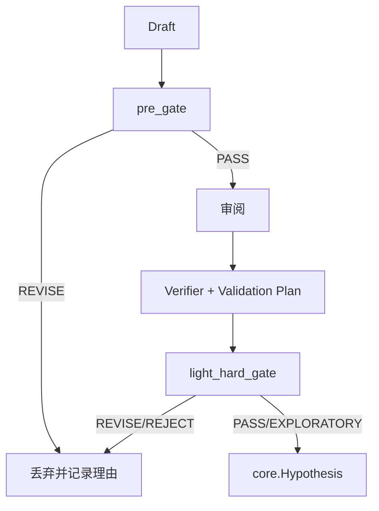
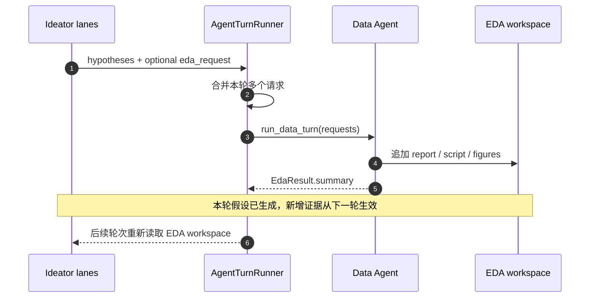

# 8 Idea Generation 设计

## 8.1 要点

Idea Generation 的特别设计：

1. 假设被结构化为可审计包：premises / inference_chain / predictions / disconfirmers。
2. 门禁独立于生成。
3. 拒绝理由反馈给生成侧重试。
4. 动态 EDA 闭环。
5. 实时路径不做本地排序。

## 8.2 当前路径

### 8.2.1 实时 Ideator（默认）

`--ideation ideageneration` 是默认路径。入口为 `AgentTurnRunner.run_ideator_turn`。

实时 Ideator 的主路径如下：调度器发出 GENERATE 后，AgentTurnRunner 启动 Ideator。Ideator 先阅读 EDA 与语料，再输出结构化假设批次。批次经过 `run_light_pipeline` 门禁后转为核心 Hypothesis 写入 ResearchTree。若 Ideator 在批次中附带 `eda_request`，则 DataAgent 会补充 EDA 并写回目录，使下一轮 Ideator 获得更强的证据基础。

`run_ideator_turn` 的流程：

```text
1. 解析并校验 EDA 目录
2. 注册 Ideator Agent
3. 计算 batch = max(count, ideator_count * hypotheses_per_ideator)
4. 分配到最多 ideator_count 个 lane
5. 并发运行 lane
6. 汇总 hypotheses
7. 收集 eda_request
8. 返回给 Supervisor.register_hypotheses
```

依据：`src/athena/research/turns/ideator.py:217-317`。

### 8.2.2 Debate Ideator

`--ideation debate` 走辩论式：proposal → review → revision → judge。

依据：`src/athena/research/turns/ideator.py:234-263`。

### 8.2.3 Baseline

`--ideation baseline` 不跑门禁，直接注册 Ideator 输出。

### 8.2.4 离线完整 workflow

当前 `src/athena/research/idea_generation/` 中不存在 `workflow.py`、`ranking.py`、`candidate_generation.py`、`hypothesis_selector.py`。旧设计文档描述的多策略生成与 Pairwise Elo 属于历史/设计文档。`[待确认]`

## 8.3 数据模型

### 8.3.1 IdeatorHypothesisDraft

`src/athena/research/idea_generation/idea_schemas.py:96-134`。

```python
class IdeatorHypothesisDraft(BaseModel):
    statement: str
    intervention: str
    expected_effect: str
    supported_premises: list[ClaimEvidence]
    inference_chain: list[InferenceStep] = []
    predicted_observations: list[str]
    disconfirming_observations: list[str]
    sources: list[str] = []
```

LLM 只写事实子集，`idea_id` / `generation_strategy` / `lineage_op` 由代码分配。

### 8.3.2 HypothesisPackage

`idea_schemas.py:155-197`。

```python
class HypothesisPackage(BaseModel):
    idea_id: str
    generation_strategy: str
    novel_hypothesis: str
    supported_premises: list[ClaimEvidence]
    inference_chain: list[InferenceStep]
    predicted_observations: list[str]
    disconfirming_observations: list[str]
    lineage_op: str
    sources: list[str] = []
```

### 8.3.3 分层证据规则

- `SUPPORTED_PREMISE` 必须绑定 `supporting_refs`。
- `NOVEL_HYPOTHESIS` 不得直接带证据引用。
- 新假设必须有 predictions 与 disconfirmers。

依据：`idea_schemas.py:68-75`、`130-134`。

## 8.4 门禁

### 8.4.1 流程



门禁采用漏斗结构。候选先经过廉价的 pre_gate，不满足结构或可证伪性要求时立即丢弃。通过者进入方法论与统计学审阅，随后生成验证方案，最终由 light_hard_gate 做出 PASS、EXPLORATORY、REVISE 或 REJECT 判定。只有 PASS 与 EXPLORATORY 能进入 ResearchTree，其余候选被丢弃，但丢弃理由会写回生成侧用于重试。

### 8.4.2 pre_gate

`src/athena/research/idea_generation/gatekeeper.py:117-148`。

```text
evidence_traceable = premise_evidence_ok AND novel_hypothesis_testable
falsifiable = FalsifiabilityReport.is_falsifiable

任一不满足 → REVISE
```

### 8.4.3 审阅

`REVIEW_PERSPECTIVES` 为 `methodology` 与 `statistics`。

审阅失败视为 fail-closed。

依据：`review_board.py:40-43`、`85-118`。

### 8.4.4 light_hard_gate

`src/athena/research/idea_generation/gatekeeper.py:151-246`。

追加：

- `risk_ok_<perspective>` ≤ 6
- `risk_total` ≤ 6N-1
- `verifier_ok`

判定顺序：

```text
结构/可证伪性 → REVISE
fatal_flaw → REJECT
视角失败/风险超阈值 → REVISE
总量超阈值 → REVISE
无 verifier → EXPLORATORY
通过 → PASS
```

### 8.4.5 阈值校准

`MAX_TOLERATED_RISKS=6` 为实测校准值。初版 2 导致无人可过；真实审阅稳定产出 4-5 条风险。`max_total_risks(N)=6N-1` 保证 `risk_total` 不是死代码。

依据：`gatekeeper.py:28-60`。

### 8.4.6 重试

`MAX_GATE_RETRIES=2`。

- 被拒候选的逐条 blocking evidence 拼进重试 prompt。
- 重试在同一条 Ideator 线程上进行。

依据：`turns/ideator.py:538-635`。

## 8.5 动态 EDA



动态 EDA 的闭环如下：Ideator 将补充分析需求写入 `eda_request`；AgentTurnRunner 汇总同一轮多个 lane 的请求后调用 Data Agent；Data Agent 以追加方式修改 EDA 工作区，并返回 `EdaResult`；下一轮 Ideator 重新打开 EDA 目录时即可读到新增报告与图片。这一机制使假设生成不再依赖一次性的静态 EDA，而能在搜索过程中持续加深数据理解。注意，增量分析发生在本轮假设已经生成之后，因此不会反向修改本轮候选。

Data Agent 约束：

- 只追加 report。
- 写 `figures/`。
- 不修改原始数据、evaluator、baseline。

依据：`src/athena/agents/prompts/data_agent.md`、`src/athena/agents/task_agents.py`。完整的初始 EDA、产物契约、失败降级与动态 EDA 设计见 [12 EDA 系统设计](12-eda-system.md)。

## 8.6 与 ResearchTree 的衔接

存活候选转为 `core.Hypothesis`，由 `Supervisor.register_hypotheses` 写入 ResearchTree。

实时流水线不做本地排序。排序交给 Scheduler / Ranker。

依据：`gate.py:160-185`。

## 8.7 关键代码路径

### 8.7.1 run_light_pipeline

```text
run_light_pipeline(drafts)
→ 为每个 draft 构造 HypothesisPackage
→ pre_gate
→ 并行审阅
→ match_verifier
→ plan_validation
→ light_hard_gate
→ 收集 survivors
→ 转为 core.Hypothesis
→ 返回
```

### 8.7.2 门禁返回

- `PASS` / `EXPLORATORY` 保留。
- `REVISE` / `REJECT` 丢弃，记录拒绝理由。

## 8.7.1 审阅视角

`REVIEW_PERSPECTIVES` 定义于 `src/athena/research/idea_generation/review_board.py:40-43`：

```python
REVIEW_PERSPECTIVES = ("methodology", "statistics")
```

审阅输出 `SkepticReport`：

```text
idea_id
perspective
critique
unaddressed_risks
fatal_flaw_found
failed
input_ref
```

## 8.7.2 验证计划

`validation.py` 提供：

```text
match_verifier(package, domain)
plan_validation(package, verifier, ...)
```

`verifier_ok` 为 False 时，light_hard_gate 返回 `EXPLORATORY`。

## 8.7.3 结构化聊天

`structured_chat.py` 使用 `Agent(output_type=...)` 完成单次结构化 LLM 调用。

## 8.8 关键代码路径

### 8.8.1 `_finish_ideator_batch`

```text
_finish_ideator_batch(lane_output, ...)
→ 根据 ideation 模式选择：
    ideageneration → run_light_pipeline
    debate → debate 流程
    baseline → 直接转为 HypothesisBatch
→ 保留 eda_request
→ 返回 hypotheses
```

### 8.8.2 `run_light_pipeline`

```text
run_light_pipeline(drafts)
→ 构造 HypothesisPackage
→ 每个 draft：
    structural_check
    falsifiability_check
    pre_gate
    并行审阅
    match_verifier
    plan_validation
    light_hard_gate
→ 保留 PASS / EXPLORATORY
→ 转为 core.Hypothesis
```

### 8.8.3 `run_data_turn`

```text
run_data_turn(request)
→ 注册 Data Agent
→ 发送任务
→ 等待 EdaResult
→ 发布 summary
```

## 8.9 边界情况

- 门禁全部拒绝：重试 2 次。
- 重试仍全部拒绝：返回空并发布错误。
- `eda_request` 为空：不触发 Data Agent。
- 审阅失败：按 fail-closed 处理。
- 无 verifier：假设进入 EXPLORATORY。
- 语料半配置：明确报错，不静默降级。

## 8.8.4 Ideator Profiles

`src/athena/agents/ideator_agent.py:60-94` 定义：

```text
EXPLOIT
BOLD
MOONSHOT
```

`SEARCH_IDEATOR_PROFILES` 在 lane 之间轮转，以增加假设多样性。

## 8.9 相关文件

```text
research/idea_generation/__init__.py
research/idea_generation/gate.py
research/idea_generation/gatekeeper.py
research/idea_generation/idea_schemas.py
research/idea_generation/review_board.py
research/idea_generation/validation.py
research/idea_generation/pre_gate_checks.py
research/turns/ideator.py
agents/ideator_agent.py
agents/task_agents.py
```

## 8.10 证据

| 结论 | 证据 |
|---|---|
| 门禁入口 | `src/athena/research/idea_generation/gate.py:156` |
| pre_gate | `src/athena/research/idea_generation/gatekeeper.py:117-148` |
| light_hard_gate | `src/athena/research/idea_generation/gatekeeper.py:151-246` |
| 动态 EDA | `src/athena/research/turns/ideator.py:319-365` |
| 无本地排序 | `src/athena/research/idea_generation/gate.py:160-185` |
