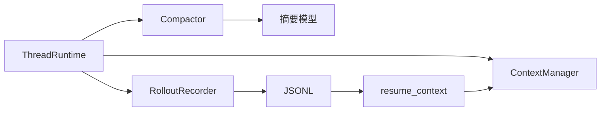
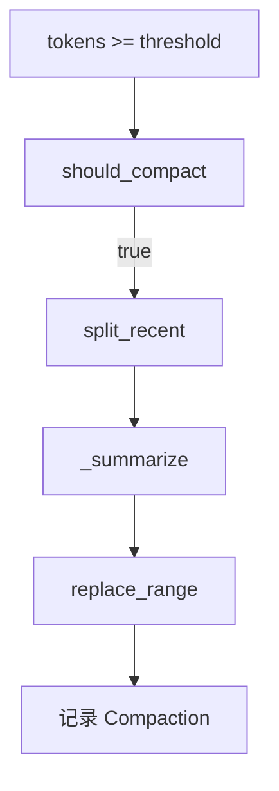

# 9 Memory System 设计

## 9.1 组件

Memory System 由三个组件构成：

```text
ContextManager   内存上下文
Compactor        上下文压缩
RolloutRecorder  JSONL 持久化
```



记忆系统各组件之间的关系如下：ThreadRuntime 同时拥有 ContextManager、Compactor 与 RolloutRecorder。ContextManager 负责内存中的消息管理；Compactor 在阈值触发时调用摘要模型压缩早期历史；RolloutRecorder 把消息与压缩检查点写入 JSONL。恢复路径从磁盘读回 JSONL，经 `resume_context` 重建 ContextManager。压缩与持久化都围绕同一个 ContextManager 工作，以保证内存与磁盘一致。

## 9.2 ContextManager

`ContextManager` 位于 `src/athena/memory/context_manager.py:16-118`。

它管理单条 Thread 的 `ModelMessage` 列表，并维护 token 不变量：

```text
_token_count == sum(estimate(m) for m in _items)
```

### 9.2.1 方法

| 方法 | 作用 |
|---|---|
| `items` | 返回深拷贝消息 |
| `tokens` | 当前估算 token 数 |
| `version` | 上下文版本号 |
| `snapshot()` | 返回 `(idx, version)` |
| `items_since(idx)` | 返回 idx 后新增消息 |
| `rollback(idx)` | 回滚到 idx |
| `append(msg)` | 追加消息 |
| `replace_range(...)` | 替换区间 |

### 9.2.2 Token 估算

- 字符串长度 / 4。
- 过长工具返回 `truncate_text` 截断。

### 9.2.3 快照协议

`snapshot()` 返回 `(idx, version)`。compaction 后 version 变化，可检测过期快照。`rollback` 恢复 token 计数，保持不变量。

```python
def snapshot(self):
    return (len(self._items), self._version)

def rollback(self, idx):
    removed = sum(self._estimate_one(m) for m in self._items[idx:])
    self._items = self._items[:idx]
    self._token_count -= removed
    self._version += 1
```

依据：`src/athena/memory/context_manager.py:56-91`。

## 9.3 Compactor

`Compactor` 位于 `src/athena/memory/compaction.py:17-138`。

当上下文 token 超过阈值时，将早期历史替换为 LLM 摘要。

### 9.3.1 配置

- `keep_recent=20_000`
- `summary_model="haiku"`
- `should_compact` 默认阈值 `170_000`

### 9.3.2 流程



压缩的触发与执行过程如下：上下文 token 超过阈值后，`should_compact` 返回真；`split_recent` 从后向前累积近期 token，确定压缩分界点；旧前缀交给摘要模型；新摘要通过 `replace_range` 替换原区间；最后记录 Compaction 检查点。压缩过程中若检测到版本变化，则立即抛错，避免覆盖并发写入的消息。

### 9.3.3 摘要格式

- 前缀：`[HISTORY SUMMARY]`
- 支持 OpenAI `chat.completions` 与 Anthropic `messages.create`。

### 9.3.4 并发保护

压缩过程中检查 `ctx.version`。若上下文被并发修改，则抛错，避免覆盖新消息。

```python
source_version = ctx.version
summary = await self._summarize(old, llm)
if ctx.version != source_version:
    raise RuntimeError("压缩过程中上下文被并发修改")
```

依据：`src/athena/memory/compaction.py:46-63`。

## 9.4 RolloutRecorder

`RolloutRecorder` 位于 `src/athena/memory/rollout.py:26-199`。

### 9.4.1 路径

```text
{project}/.athena/sessions/{year}/{month}/{day}/rollout-{short_id}-{uuid}.jsonl
```

### 9.4.2 格式

普通消息：

```json
{"seq":0,"ts":"...","msg":[...]}
```

压缩检查点：

```json
{"seq":1,"type":"compaction","version":2,"summary":"..."}
```

### 9.4.3 写入策略

每次写入后立即 flush。崩溃后仍保留已写入记录。

### 9.4.4 恢复

```text
resume_context(rollout_path)
→ 流式读取 JSONL
→ 遇到 compaction 重置 ContextManager
→ 后续消息继续 append
→ 损坏/截断记录跳过
```

```python
def _resume_context_sync(rollout_path):
    ctx = ContextManager()
    for line in rollout_path.open(...):
        if record.get("type") == "compaction":
            ctx = ContextManager()
            ctx.append(ModelRequest(parts=[SystemPromptPart(...)]))
            continue
        messages = adapter.validate_python(payload)
        for message in messages:
            ctx.append(message)
    return ctx
```

依据：`src/athena/memory/rollout.py:122-199`。

## 9.5 与 ThreadRuntime 集成

`ThreadRuntime` 拥有 `ctx`、`compactor`、`rollout`、`llm`。

### 9.5.1 Turn 前

`maybe_compact()` 在 turn 前检查并压缩。

### 9.5.2 Turn 成功

`record_items()` 持久化新消息。

### 9.5.3 Turn 失败

`rollback` 到 `before_index`，保证内存与磁盘一致。

### 9.5.4 Turn 取消

仍持久化已产生的消息。

依据：`src/athena/app_server/thread_runtime.py:80-224`、`533-633`。

## 9.6 与 ThreadManager 集成

`RuntimeThreadManager._make_runtime` 位于 `src/athena/app_server/thread_manager.py:72-104`。

- 每个 Thread 创建独立 `ContextManager`。
- 设置 `rollout_dir` 时使用 `{rollout_dir}/{session_id}.jsonl`。
- 文件非空时通过 `resume_context_sync` 恢复记忆。

```python
if self._rollout_dir is not None:
    path = self._rollout_dir / f"{session_id}.jsonl"
    recorder.open_sync(session_id, append_to=path)
    if path.exists() and path.stat().st_size > 0:
        kwargs["ctx"] = resume_context_sync(path)
```

## 9.7 与 AgentRuntime 集成

`AgentRuntime` 将 `rollout_dir`、`compactor`、`llm` 传入 manager。

`set_summarizer` 可迟装配压缩组件。

`_ThreadRunner` 构造 `RunSession`，给每个 turn 提供只读 memory 视图。

依据：`src/athena/core/agent/agent_runtime.py:107-153`、`src/athena/core/agent/session.py:18-82`。

## 9.8 平行实现

Rust 平行实现位于 `athena-rust/crates/athena-memory/`：

- `message.rs`
- `context.rs`
- `compaction.rs`
- `rollout.rs`

接入状态未确认。`[待确认]`

## 9.8.1 Message 模型

Python 使用 PydanticAI `ModelMessage`。Rust 提供兼容模型：

- Rust：`athena-rust/crates/athena-memory/src/message.rs`

## 9.8.2 记忆视图

`RunSession._MemoryView` 是只读视图。`BaseAgentRunner` 通过 `session.memory.raw` 访问底层 `ContextManager`，用于 mailbox 消息注入。

## 9.8.3 恢复策略

- 有 `rollout_dir`：按 `session_id.jsonl` 恢复。
- 无 `rollout_dir`：从空上下文开始。
- 有 compaction 检查点：以最新检查点为起点。

## 9.9 关键代码路径

### 9.9.1 `maybe_compact`

```text
maybe_compact()
→ compactor is None? return
→ should_compact(ctx)?
→ compact(ctx, llm)
→ 若有原始消息：
    rollout.record_compaction(version, summary)
    tail = ctx.items_since(1)
    for msg in tail: rollout.record(msg)
→ 返回 Compaction
```

### 9.9.2 `_run_turn` 中的记忆处理

```text
_run_turn(...)
→ maybe_compact()
→ before_index = ctx.snapshot()
→ 执行 runner
→ 成功：
    record_items(new_messages)
    send RunnerSucceeded
→ 取消：
    persist produced messages
    send RunnerCancelled
→ 异常：
    ctx.rollback(before_index)
    send RunnerFailed
```

### 9.9.3 `resume_context`

```text
resume_context(rollout_path)
→ 逐行读取
→ compaction 行：重置 ContextManager，写入摘要
→ msg 行：append
→ 损坏行：跳过
→ 返回 ContextManager
```

## 9.10 边界情况

- rollout 文件截断：跳过损坏行。
- 压缩期间并发修改：抛错。
- 无 rollout：不持久化。
- 恢复时无 compaction：从零开始。
- 工具返回过长：截断后写入。

## 9.9.4 Token 估算细节

```python
@staticmethod
def _estimate_one(msg):
    total = 0
    for part in msg.parts:
        c = getattr(part, "content", None)
        if isinstance(c, str):
            total += len(c)
        a = getattr(part, "args", None)
        if a is not None:
            total += len(str(a))
    return max(1, total // 4)
```

该估算用于压缩阈值判断，不用于计费。

## 9.10 相关文件

```text
memory/__init__.py
memory/context_manager.py
memory/compaction.py
memory/rollout.py
app_server/thread_runtime.py
app_server/thread_manager.py
core/agent/agent_runtime.py
core/agent/session.py
```

## 9.11 证据

| 结论 | 证据 |
|---|---|
| ContextManager | `src/athena/memory/context_manager.py:16-118` |
| Compactor | `src/athena/memory/compaction.py:26-138` |
| Rollout | `src/athena/memory/rollout.py:26-199` |
| ThreadRuntime 集成 | `src/athena/app_server/thread_runtime.py:80-224`、`533-633` |
| ThreadManager | `src/athena/app_server/thread_manager.py:72-104` |
| AgentRuntime | `src/athena/core/agent/agent_runtime.py:107-153` |
