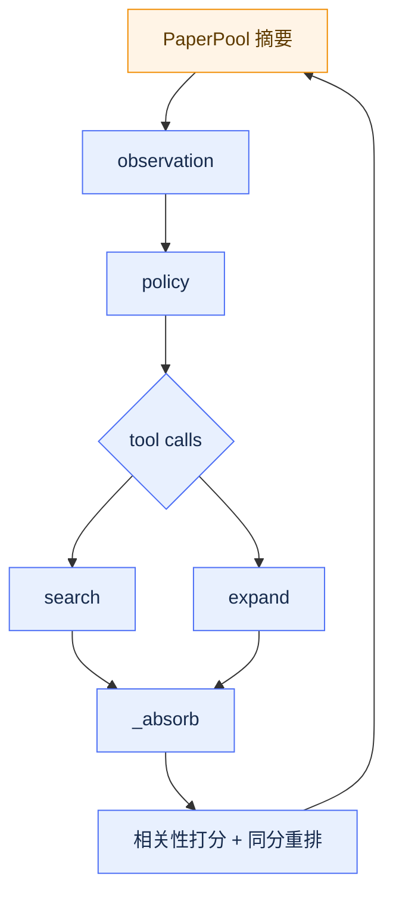

# 10 搜索论文系统设计

> paper wiki 暂不展开。

## 10.1 流程

论文系统是一条确定性流水线：

```text
SurveyRequest
→ PaperScout
→ paper_source
→ paper_markdown
→ paper_rag
→ corpus_ref
→ Ideator
```

论文系统的主链如下：SurveyRequest 进入 PaperScout 后得到候选论文；paper_source 按标识符取回 TeX 或 PDF 字节；paper_markdown 把源文件转换为结构化 Markdown；paper_rag 建立索引并输出 `corpus_ref`；Ideator 最终通过工具与 prompt 消费语料。每段只依赖上一段的输出，不形成反馈回路。

## 10.2 原则

- 四段之间没有多轮 Agent 推理。
- 每段失败不终止整轮。
- 组合根唯一：`build_survey_stack()`。
- Ideator 的 sources 必须经过 `paper_chunk_read` 核验。

## 10.3 Survey 组合根

`build_survey_stack()` 位于 `src/athena/research/literature/survey/wiring.py`。

装配：

- `LocalArtifactStore`
- `AsyncOpenAI`
- `HostRateLimiter`
- `PaperLibrary`
- `OpenAIEmbedder`
- `VisionInterpreter`
- `DashScopeReranker`
- `SurveyPipeline`
- `build_survey_tools`

`run_survey(stack, request)` 返回 `SurveyReport`。

`SurveyStack` 是组合根对象，保存 artifacts、client、model、http、scorer_model、embedder、visual_interpreter、contact_email、keys、ghostscript、corpus_cache、library、reranker。

`build_survey_tools` 注册：

- `paper_survey`
- `paper_fetch`
- `paper_markdown`
- `paper_corpus_overview`
- `paper_keyword_search`
- `paper_chunk_read`
- `paper_visual_of`
- `paper_cites`
- `paper_section_search`
- 可选 `paper_semantic_search` / `paper_search`

依据：`src/athena/research/literature/survey/wiring.py:341-410`、`412-525`。

## 10.4 PaperScout

### 10.4.1 建模

- POMDP。
- 隐状态：`PaperPool`。
- 动作：`search(query)`、`expand(locator)`。
- 无对话历史。
- 停止：连续 3 步池大小不变，或超时。

### 10.4.2 流程



PaperScout 内部的搜索闭环如下：Agent 在循环中观察候选池摘要，经策略模型发出 search 或 expand 动作；动作结果被 `_absorb` 吸收，经过相关性打分与同分重排后写回 PaperPool。PaperPool 是隐状态，Agent 每步只看到其摘要而非全部内容。

达到停止条件后，交付链路不再回到搜索循环：


`_finish` 对候选池做选择与截断，输出 `ScoutCorpus`，再转换为后续取源阶段使用的 `PaperSourceRequest`。拆分搜索闭环与交付链路后，图中不再同时出现循环回边和终态支线。

### 10.4.3 打分

`GradedRelevanceScorer`：

- 0–3 分。
- 映射 `GRADE_SCORES=(0.0, 0.2, 0.45, 1.0)`。
- 默认 batch 24。
- `RETAIN_THRESHOLD=0.0`，`ACCEPT_THRESHOLD=0.01`。

### 10.4.4 选片

`select_delivery`：

- 先按截断线切分。
- 边界档不够时调用 selector。
- 无 selector 回退 `hash_order`。

依据：`src/athena/research/literature/paper_scout/selection.py`。

## 10.5 paper_source

### 10.5.1 阶段

```text
截断
→ arXiv 版本解析
→ 逐篇取源
→ 魔数判定
→ ArtifactStore
→ ConversionRequest
```

### 10.5.2 取源通道

```text
arXiv /src
→ arXiv /pdf
→ 上游 OA PDF
→ OpenAlex PDF
→ OpenAlex content API
```

### 10.5.3 限流

`HostRateLimiter` 按服务分桶。

重试覆盖：

```text
429
500
502
503
504
HttpTransportError
```

请求强制 `Accept-Encoding: identity`。

### 10.5.4 字节判定

`sniff_payload` 只认：

```text
%PDF-
zip
gzip
tar
plain TeX
```

不信任 `Content-Type`。

依据：`src/athena/research/literature/paper_source/fetcher.py`、
`src/athena/research/literature/paper_source/http.py`。

## 10.6 paper_markdown

### 10.6.1 输入

- TeX：tar/tar.gz/zip/gzip/plain。
- 递归展开 `\input` / `\include` / `\subfile`。
- PDF：PyMuPDF。
- `includepdf` wrapper 回退 PDF。

### 10.6.2 输出

```text
ParsedPaper
→ 结构修复
→ 视觉解释
→ chunking
→ quality gate
→ PaperContent
```

### 10.6.3 视觉

- 按魔数识别真实格式。
- MuPDF 覆盖 PDF/SVG/常见位图。
- Ghostscript 处理 EPS/PS。
- `visual_policy=required` 失败整篇失败。
- `best_effort` 退回证据文本。

### 10.6.4 质量等级

```text
pass
pass_with_notes
degraded
unknown
```

依据：`src/athena/research/literature/paper_markdown/processor.py`、
`src/athena/research/literature/paper_markdown/quality.py`。

## 10.7 paper_rag

### 10.7.1 索引

`build_corpus_index`：

- 接收 `list[PaperContent]`。
- 返回 `corpus_ref`。
- `split_sentences` 保留公式块。
- 参考文献解析为 citation/reference edges。
- 向量按篇编码，float32 numpy 打包。

### 10.7.2 算子

| 算子 | 作用 |
|---|---|
| `paper_corpus_overview` | 总览 |
| `paper_keyword_search` | 词法 |
| `paper_semantic_search` | 语义 |
| `paper_search` | RRF |
| `paper_chunk_read` | 整篇读取 |
| `paper_visual_of` | 图文 |
| `paper_cites` | 引用 |
| `paper_section_search` | 章节遍历 |

依据：`src/athena/research/literature/paper_rag/`。

## 10.8 Ideator 消费

- `ResearchRuntime.corpus_tools(for_ideation=True)` 注入只读 RAG 工具。
- 每个 Ideator 独立 `RetrievalSession`。
- `_corpus_block` 把语料总览拼进 prompt。
- `_verify_sources` 只保留真正打开过全文的论文。

依据：`src/athena/research/runtime/facade.py:596-707`、`src/athena/research/turns/ideator.py:689-716`。

## 10.9 真机基线

| 项目 | 数值 |
|---|---|
| 候选/交付 | 240 / 50 |
| 取源成功 | 44 / 50 |
| 转换成功 | 44 / 44 |
| 语料 | 44 篇 / 4928 chunk / 36920 句向量 |
| 耗时 | 约 2375s |

依据：`docs/academic_survey_ch.md:263-299`。

## 10.9.1 环境变量

```text
ATHENA_SURVEY_MODEL
ATHENA_SCORER_MODEL
ATHENA_EMBEDDING_MODEL
ATHENA_VISION_MODEL
ATHENA_ARTIFACT_ROOT
ATHENA_CONTACT_EMAIL
SEMANTIC_SCHOLAR_API_KEY
OPENALEX_API_KEY
ATHENA_GHOSTSCRIPT
```

缺失时按 `docs/academic_survey_ch.md` 降级。

## 10.9.2 文件结构

```text
literature/
├── __init__.py
├── contracts.py
├── bench/
│   ├── __init__.py
│   ├── health.py
│   ├── known_item.py
│   ├── query_sets.py
│   ├── recall.py
│   ├── reproducibility.py
│   └── schemas.py
├── paper_scout/
│   ├── __init__.py
│   ├── agent.py
│   ├── backends.py
│   ├── pool.py
│   ├── schemas.py
│   ├── scorer.py
│   ├── selection.py
│   └── session.py
├── paper_source/
│   ├── __init__.py
│   ├── arxiv.py
│   ├── fetcher.py
│   ├── http.py
│   ├── openalex.py
│   └── schemas.py
├── paper_markdown/
│   ├── __init__.py
│   ├── chunking.py
│   ├── models.py
│   ├── pdf_elements.py
│   ├── pdf_parser.py
│   ├── processor.py
│   ├── quality.py
│   ├── tex_parser.py
│   ├── tex_render.py
│   ├── tex_source.py
│   ├── tex_tables.py
│   ├── tool.py
│   └── visuals.py
├── paper_rag/
│   ├── __init__.py
│   ├── index.py
│   ├── models.py
│   ├── search.py
│   └── tool.py
└── survey/
    ├── __init__.py
    ├── library.py
    ├── pipeline.py
    ├── providers.py
    ├── report.py
    └── wiring.py
```

## 10.10 关键代码路径

### 10.10.1 `SurveyPipeline`

```text
run_survey(stack, request)
→ ScoutStage
→ FetchStage
→ ConversionStage
→ IndexStage
→ SurveyReport
```

### 10.10.2 `PaperScoutAgent.run`

```text
run(request)
→ 创建 ScoutSession
→ loop:
    observation()
    policy stream
    parallel tool calls
    _absorb()
→ _finish()
→ ScoutCorpus + PaperSourceRequest
```

### 10.10.3 `PaperSourceFetcher.fetch`

```text
fetch(request)
→ 截断 max_papers
→ arXiv resolve_batch
→ 逐篇尝试通道
→ sniff_payload
→ 落盘 ArtifactStore
→ 生成 PaperSourceRecord
```

### 10.10.4 `build_corpus_index`

```text
build_corpus_index(contents)
→ load_retrieval_units
→ split_sentences
→ paper_anchors
→ citation/reference edges
→ 按论文复用缓存或编码句向量
→ 返回 corpus_ref
```

## 10.11 边界情况

- 取源失败：记 warning，继续下一个候选。
- 转换失败：记失败原因，不进索引。
- 索引失败：`corpus_ref=None`，报告 `partial`。
- 视觉缺失：`best_effort` 降级，`required` 整篇失败。
- 无 embedding 模型：语义检索关闭，词法照常。

## 10.10.5 CLI 示例

```bash
Athena-cli survey --check
Athena-cli survey --query "regularization techniques for AUC on imbalanced data"
Athena-cli survey --papers 1706.03762,1512.03385
```

常用参数：

```text
--max-papers
--scorer-model
--retain-threshold
--source-candidates
--strict-quality
--concurrency
--max-seconds
--no-index
```

## 10.11 相关文件

```text
src/athena/research/literature/survey/wiring.py
src/athena/research/literature/survey/pipeline.py
src/athena/research/literature/survey/library.py
src/athena/research/literature/survey/report.py
src/athena/research/literature/paper_scout/
src/athena/research/literature/paper_source/
src/athena/research/literature/paper_markdown/
src/athena/research/literature/paper_rag/
```

## 10.12 证据

| 结论 | 证据 |
|---|---|
| Survey | `src/athena/research/literature/survey/wiring.py`、`src/athena/research/literature/survey/pipeline.py` |
| PaperScout | `src/athena/research/literature/paper_scout/` |
| paper_source | `src/athena/research/literature/paper_source/` |
| paper_markdown | `src/athena/research/literature/paper_markdown/` |
| paper_rag | `src/athena/research/literature/paper_rag/` |
| Ideator 消费 | `src/athena/research/runtime/facade.py:596-707`、`src/athena/research/turns/ideator.py:689-716` |
