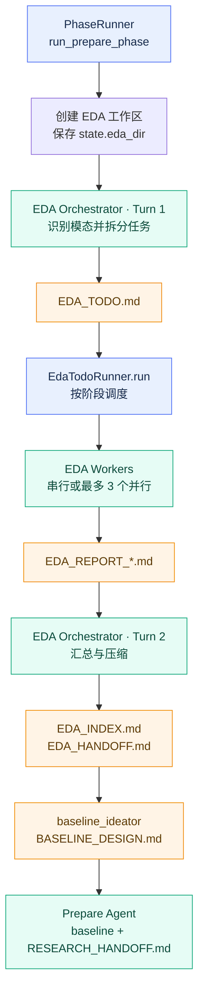
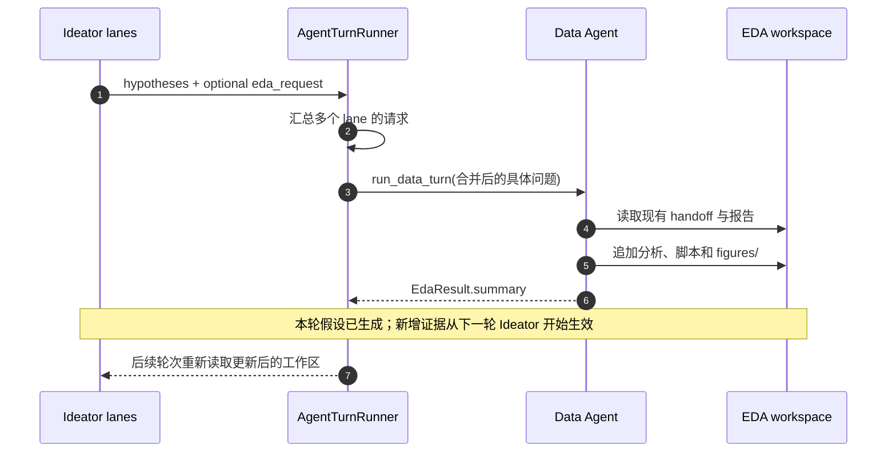

# 12 EDA 系统设计

## 12.1 定位

Athena 的 EDA 不是一份一次性分析报告，而是贯穿 PREPARE 与 SEARCH 的共享研究基础设施。它有两条互补路径：

1. **PREPARE EDA**：在实验搜索开始前建立数据事实、风险清单和 baseline 设计依据。
2. **动态 EDA**：SEARCH 中的 Ideator 发现证据缺口后，按需追加一项具体分析，供后续生成轮次使用。

两条路径共用同一个 EDA 工作区，但职责不同。PREPARE EDA 建立初始知识底座；动态 EDA 只补充缺失证据，不重新执行全量探索。

## 12.2 设计目标与边界

EDA 子系统需要同时满足以下目标：

- **覆盖面可规划**：先识别数据模态，再拆分 overview、质量、字段、目标、关系、泄漏和 baseline 等分析任务。
- **执行可并行**：相互独立的报告可并行生成，存在前置依赖的阶段仍按顺序执行。
- **结论可引用**：重要发现使用 `eda:<report>:<id>` 标识，让 baseline 与 Ideator 能精确引用来源。
- **与评估隔离**：EDA Agent 不得修改原始数据、冻结 evaluator 或其他实验的结果。
- **失败可降级**：单个 worker 失败会重试；整条 EDA 链路失败时生成最小占位 handoff，让 PREPARE 仍可基于任务与原始数据继续。
- **状态保持轻量**：`ResearchState` 只保存 `eda_dir` 路径，不把大段报告塞入状态 JSON。

所有 EDA 内容都位于项目内的工作区。默认布局是 `<project>/workspaces/eda`；`state.eda_dir` 保存相对于项目根的路径，因此项目移动或分叉后仍可重新解析。

## 12.3 PREPARE EDA 总流程



### 12.3.1 创建与持久化工作区

`PhaseRunner.run_prepare_phase()` 先初始化内部 Git 仓库，再调用 `LocalGitWorkspace.create(..., name="eda")` 创建 EDA 工作区。随后：

- 将工作区解析为项目内路径；
- 把相对路径写入 `state.eda_dir`；
- 立即持久化 `ResearchState`；
- 通过 `output` 事件发布相对路径和实际绝对路径。

这里刻意只持久化路径。EDA 报告、图片、baseline 源码等仍留在工作区文件系统中，避免 `state.json` 膨胀，也让 Agent 能用普通文件工具继续探索。

### 12.3.2 Orchestrator 第一轮：生成任务图

`prepare/eda.py` 是单一 EDA orchestrator。第一轮读取任务和数据工作区，判断数据模态，然后写 `EDA_TODO.md`。默认计划包含：

| 阶段 | 典型任务 | 并行策略 |
|---|---|---|
| Overview | 文件、规模、数据划分、schema | 串行，先建立共同上下文 |
| Independent Profiles | 数据质量、字段画像、目标分布 | 最多 3 个 worker 并行 |
| Relationships | 特征关系、泄漏、train/test 漂移 | 最多 3 个 worker 并行 |
| Final | baseline 线索、索引与 handoff | 串行 |

Orchestrator 可根据模态增加专用任务。例如图像数据需要尺寸、通道与类别样本检查；文本数据需要长度、语言、重复和标签泄漏检查；时序数据需要时间覆盖、间隔、缺口和时间泄漏检查。

`EDA_TODO.md` 的调度语法是代码契约，不是自由格式：

```markdown
## Stage 2: Independent Profiles (parallel: true)
- [ ] 01 Data Quality -> EDA_REPORT_01_DATA_QUALITY.md
- [ ] 02 Columns -> EDA_REPORT_02_COLUMNS.md
```

- 阶段标题必须以 `(parallel: true|false)` 结尾；
- todo 必须使用未勾选的 GitHub checkbox；
- `->` 后是该 worker 必须写出的单个目标文件；
- 无法解析的行不会进入调度队列。

### 12.3.3 Todo Runner：阶段化并发

`EdaTodoRunner.run()` 逐阶段执行任务，不跨阶段并发。Runner 只保存
`agents` / `store` / `workspace` 三个资源，调度策略由 `EdaTodoOptions` 统一携带：

```text
解析 Stage
→ 根据 parallel 选择 batch_size（1 或 max_workers）
→ spawn eda_worker
→ 等待结构化 HandoffResult
→ 检查目标文件确实存在
→ 成功则把 [ ] 改为 [x]
→ 失败则重试，最终仍失败时保留 [ ]
→ reap 一次性 worker
```

默认 `max_workers=3`、`retries=2`，即一个失败任务最多执行 3 次。并发只发生在同一 `parallel: true` 阶段内；上一阶段的全部 batch 结束后才进入下一阶段。

每个 `eda_worker` 只能创建或覆盖分配给自己的报告，不得修改其他 worker 的报告、原始数据或 evaluator。报告必须给出具体数值，并给重要发现分配稳定的 `eda:<report>:<id>` 引用。

### 12.3.4 Orchestrator 第二轮：索引与 handoff

所有 worker 完成后，原 orchestrator 通过 follow-up 进入第二轮，读取 `EDA_REPORT_*.md` 并生成：

- `EDA_INDEX.md`：报告目录和每份报告的关键结论；
- `EDA_HANDOFF.md`：提供给 baseline 设计器的压缩统计上下文。

`EDA_HANDOFF.md` 至少应包含数据模态、文件与样本规模、train/test 划分、目标分布、关键特征统计、五项最重要发现和 baseline 建议。它的作用不是替代详细报告，而是让下游 Agent 先读取一个稳定、低成本的入口，再按引用打开具体报告。

### 12.3.5 从 EDA 到 baseline

EDA 成功后，数据事实经过两次职责分离的转换：

```text
EDA_HANDOFF.md
→ baseline_ideator：结合 EDA 证据和领域先验
→ BASELINE_DESIGN.md：给出一个主架构和最多两个备选
→ Prepare Agent：实现、运行并修复 baseline
→ RESEARCH_HANDOFF.md：记录指标、运行方式、关键文件和改进方向
→ SEARCH Ideator
```

`baseline_ideator` 只负责设计，不直接写实验假设。Prepare Agent 优先执行 `BASELINE_DESIGN.md` 的主方案，并在 baseline 可复现后写 `RESEARCH_HANDOFF.md`。SEARCH 首先读取的是 `RESEARCH_HANDOFF.md`，需要细节时再打开 EDA 报告和 baseline 产物。

## 12.4 EDA 工作区产物

| 文件或目录 | 写入者 | 消费者 | 作用 |
|---|---|---|---|
| `EDA_TODO.md` | `prepare/eda.py` orchestrator | `EdaTodoRunner`、开发者 | EDA 任务图、阶段并发标记和完成状态 |
| `EDA_REPORT_*.md` | `eda_worker` | orchestrator、baseline/SEARCH Agent | 单主题分析和可引用发现 |
| `EDA_INDEX.md` | `prepare/eda.py` orchestrator | 人类、下游 Agent | 全部 EDA 报告的导航和摘要 |
| `EDA_HANDOFF.md` | `prepare/eda.py` orchestrator | `baseline_ideator` | baseline 设计所需的压缩数据事实 |
| `BASELINE_DESIGN.md` | `baseline_ideator` | Prepare Agent | 主 baseline 架构、备选方案和 EDA 依据 |
| `RESEARCH_HANDOFF.md` | Prepare Agent | SEARCH Ideator、Data Agent | baseline 指标、复现方式、限制与改进方向 |
| `figures/` | EDA Worker / Data Agent | 人类、Ideator | 带标题和坐标标注的可视化证据 |
| `eda_extra.py` 等脚本 | Dynamic Data Agent | 审计、复现 | 某次增量分析的可执行实现 |

`EDA_HANDOFF.md` 与 `RESEARCH_HANDOFF.md` 不应混淆：前者是“数据告诉我们什么”，后者是“baseline 做了什么、结果如何、SEARCH 从哪里继续”。

## 12.5 SEARCH 中的动态 EDA

初始 EDA 不可能预见每个研究假设需要的证据。因此 Ideator 的结构化输出包含可选字段 `eda_request`。只有在现有 EDA 不足以支持可靠推理时才填写它。



动态 EDA 的关键语义：

- 多个 lane 的非空请求被合并成一次项目符号列表，再派给同一个 Data Agent；
- Data Agent 使用稳定 id `data`，已存在时通过 follow-up 继续同一线程；
- Data Agent 只执行收到的具体分析，不重新做全量 EDA；
- 新内容追加到已有 Markdown 报告，图片写入 `figures/`；
- 原始数据、evaluator、baseline 源码、`predictions/` 和 `experiment.json` 都是只读边界；
- `EdaResult` 只返回一句摘要，真正的研究证据仍在 EDA 工作区；
- 动态 EDA 在本轮 Ideator 已生成假设后执行，因此主要服务于下一轮，而不是修改本轮输出。

当前 Data Agent Prompt 只保证 `numpy`、`pandas`、`matplotlib` 可用，并要求图片使用清晰标题与标签，优先以 300 dpi 写入。修改依赖假设前应同步检查实际运行环境。

## 12.6 失败、恢复与项目边界

### 12.6.1 PREPARE EDA 降级

失败分为两层：

1. **单 todo 失败**：worker 按默认策略重试两次；仍失败则保持 checkbox 未勾选，并把任务文本加入失败列表。
2. **阶段链路失败**：`PhaseRunner` 写入最小 `EDA_INDEX.md`、`EDA_HANDOFF.md`，并为 todo 中缺失的 `EDA_REPORT_*.md` 生成占位文件。

如果 `EdaTodoRunner.run()` 返回失败项，`eda_ok=False`，系统跳过 `BASELINE_DESIGN.md`，让 Prepare Agent 基于任务原文和原始数据降级执行。若 worker 成功但最终汇总缺失索引或 handoff，系统补写 fallback 文件，避免下游因文件不存在直接崩溃。

### 12.6.2 路径安全

`AgentTurnRunner._resolve_eda_dir()` 在每次 SEARCH 使用前检查：

- 相对路径按当前项目根解析；
- 目录必须真实存在；
- 最终路径必须仍位于当前项目内；
- 缺少 `state.eda_dir` 时，仅在默认 `workspaces/eda` 已存在的情况下回退。

运行时加载旧状态时也会清除指向其他项目的 `eda_dir`。这能防止复制状态文件后误读另一个项目的数据与报告。

### 12.6.3 项目分叉

从已完成 PREPARE 的项目创建 A/B 分支时，`fork_project()` 会复制相对路径指向的 EDA 工作区。只复制 `.athena` 状态而不复制 `workspaces/eda` 会导致 Ideator 的路径校验失败，因此 EDA 工作区是分叉契约的一部分。

### 12.6.4 当前风险点

- Todo 语法是基于正则的严格 Markdown 契约；标题或箭头格式写错会被静默忽略，而不是报 schema 错误。
- Worker 成功必须同时满足结构化结果可解析和目标文件存在；只返回“完成”但没写文件仍算失败。
- 动态 Data Agent 失败会从 `run_data_turn()` 抛出，不像 PREPARE EDA 那样自动写 fallback；修改这一行为时要明确 SEARCH 是继续、重试还是终止本轮生成。
- 动态 EDA 采用追加写入。长期运行时报告可能增长，需要依靠索引、明确标题和精确请求避免重复分析。

## 12.7 修改 EDA 功能从哪里开始

| 修改目标 | 首先查看 | 相关验证 |
|---|---|---|
| 改 PREPARE EDA 顺序或降级 | `src/athena/research/prepare/orchestrator.py`、`src/athena/research/prepare/eda.py` | PREPARE phase、fallback 和断点测试 |
| 改 todo 语法、并发或重试 | `src/athena/research/prepare/eda.py` | `test/unit/research/test_eda_todo.py` |
| 改 orchestrator 规划/汇总内容 | `src/athena/agents/prompts/prepare_eda_agent.md` | todo 解析契约、handoff 文件检查 |
| 改单份 EDA 报告质量要求 | `src/athena/agents/prompts/eda_worker_agent.md` | worker 输出文件与引用格式 |
| 改 baseline 如何消费 EDA | `src/athena/agents/prompts/baseline_ideator_agent.md` | `BASELINE_DESIGN.md`、Prepare prompt 契约 |
| 改动态 EDA 触发时机 | `src/athena/research/turns/ideator.py::run_ideator_turn` | `test_runtime_ideators.py` |
| 改动态分析写入规则 | `src/athena/agents/prompts/data_agent.md` | Data Agent 工具权限与工作区边界 |
| 改 `eda_request` 结构 | `core/research_models.py`、`idea_generation/idea_schemas.py` | gated/baseline 输出兼容测试 |
| 改项目分叉时的 EDA 继承 | `research/fork.py::_carry_eda_workspace` | fork 路径与隔离测试 |

## 12.8 关键代码路径

```text
src/athena/research/prepare/orchestrator.py
src/athena/research/prepare/eda.py
src/athena/research/turns/ideator.py
src/athena/research/fork.py
src/athena/research/prepare/eda.py
src/athena/agents/task_agents.py
src/athena/core/research_models.py
src/athena/research/idea_generation/idea_schemas.py
src/athena/agents/prompts/prepare_eda_agent.md
src/athena/agents/prompts/eda_worker_agent.md
src/athena/agents/prompts/baseline_ideator_agent.md
src/athena/agents/prompts/data_agent.md
```

## 12.9 证据

| 结论 | 源码依据 |
|---|---|
| EDA 工作区创建与相对路径持久化 | `src/athena/research/prepare/eda.py` |
| PREPARE EDA 编排和 fallback | `src/athena/research/prepare/orchestrator.py`、`src/athena/research/prepare/eda.py` |
| todo 解析、阶段并发、重试与 checkbox | `src/athena/research/prepare/eda.py` |
| orchestrator 两轮输出契约 | `src/athena/agents/prompts/prepare_eda_agent.md` |
| worker 单文件写入边界 | `src/athena/agents/prompts/eda_worker_agent.md` |
| baseline 设计消费 EDA handoff | `src/athena/agents/prompts/baseline_ideator_agent.md` |
| 动态 EDA 请求聚合与 Data Agent | `src/athena/research/turns/ideator.py:217-365` |
| 动态 EDA 追加写入边界 | `src/athena/agents/prompts/data_agent.md` |
| EDA 路径校验 | `src/athena/research/turns/ideator.py:192-215` |
| 分叉复制 EDA 工作区 | `src/athena/research/fork.py::_carry_eda_workspace` |
